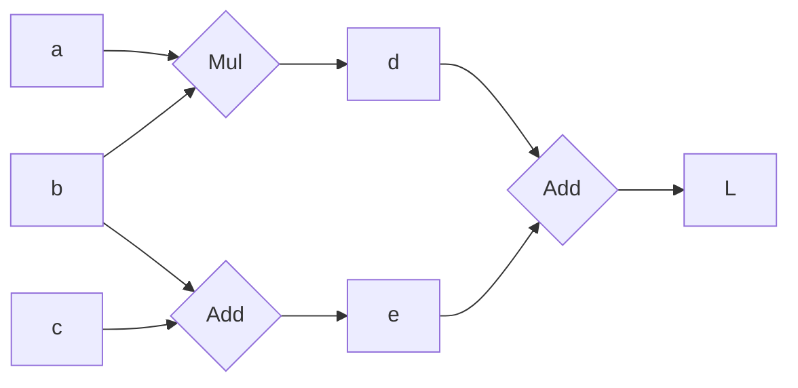
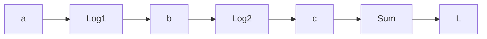
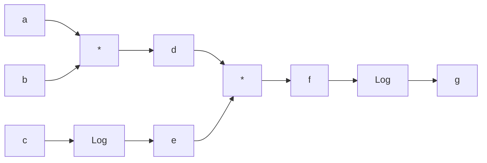

# W1D3 - Build Your Own Backpropagation Framework

Today you're going to build your very own system that can run the backpropagation algorithm in essentially the same way as PyTorch does. By the end of the day, you'll be able to train a multi-layer perceptron neural network using your own backprop system!

The main differences between the full PyTorch and our version are:

- We will focus on CPU only, as all the ideas are the same on GPU.
- We will use NumPy arrays internally instead of ATen, the C++ array type used by PyTorch. Backpropagation works independently of the array type.
- A real `torch.Tensor` has about 700 fields and methods. We will only implement a subset that are particularly instructional and/or necessary to train the MLP.

## Table of Contents

- [Readings](#readings)
- [Computing Gradients with Backpropagation](#computing-gradients-with-backpropagation)
    - [Backward Functions](#backward-functions)
    - [Backpropagation](#backpropagation)
- [Static Typing In Python Crash Course](#static-typing-in-python-crash-course)
- [Backward functions](#backward-functions)
    - [Backward function of log](#backward-function-of-log)
- [Backwards Functions of Two Tensors](#backwards-functions-of-two-tensors)
    - [Broadcasting Rules](#broadcasting-rules)
    - [Backward Function for Elementwise Multiply](#backward-function-for-elementwise-multiply)
- [Autograd](#autograd)
    - [Wrapping Arrays (Tensor)](#wrapping-arrays-tensor)
    - [Recipe](#recipe)
- [Registering backwards functions](#registering-backwards-functions)
- [Tensors](#tensors)
    - [requires_grad](#requiresgrad)
- [Forward Pass: Building the Computational Graph](#forward-pass-building-the-computational-graph)
- [Forward Pass - Generic Version](#forward-pass---generic-version)
- [Backpropagation](#backpropagation-)
    - [Topological Sort](#topological-sort)
    - [The Actual Backprop Function](#the-actual-backprop-function)
- [Filling out the Tensor class with forward and backward methods](#filling-out-the-tensor-class-with-forward-and-backward-methods)
- [Non-Differentiable Functions](#non-differentiable-functions)
- [Implementing `negative`](#implementing-negative)
- [Implementing `exp`](#implementing-exp)
- [Reshape](#reshape)
- [Permute](#permute)
- [Expand](#expand)
- [Backwards Pass - Sum](#backwards-pass---sum)
- [Backwards Pass - Indexing](#backwards-pass---indexing)
- [Elementwise addition, subtract, true_divide](#elementwise-addition-subtract-truedivide)
- [In-Place Operations](#in-place-operations)
- [Mixed scalar-tensor operations](#mixed-scalar-tensor-operations)
- [Splitting Gradients - elementwise maximum](#splitting-gradients---elementwise-maximum)
- [Functional ReLU](#functional-relu)
- [2D Matrix Multiply](#d-matrix-multiply)
- [Build Your Own `nn.Parameter`](#build-your-own-nnparameter)
- [Build Your Own `nn.Module`](#build-your-own-nnmodule)
- [Build Your Own Linear Layer](#build-your-own-linear-layer)
- [Build Your Own Cross-Entropy Loss](#build-your-own-cross-entropy-loss)
- [Build Your Own `no_grad`](#build-your-own-nograd)
- [Training Your Network](#training-your-network)
    - [Training Loop](#training-loop)
- [Bonus](#bonus)
    - [In-Place Operation Warnings](#in-place-operation-warnings)
    - [In-Place ReLU](#in-place-relu)
    - [Backward for einsum](#backward-for-einsum)
    - [Reuse of Module during forward](#reuse-of-module-during-forward)
    - [ResNet Support](#resnet-support)
    - [Central Difference Checking](#central-difference-checking)
    - [Non-Differentiable Function Support](#non-differentiable-function-support)
    - [Differentiation wrt Keyword Arguments](#differentiation-wrt-keyword-arguments)
    - [torch.stack](#torchstack)

## Readings

- [Max's Extension of Chris Olah's "Calculus on Computational Graphs: Backpropagation"](https://witty-mirror-0a0.notion.site/Automatic-differentiation-f5f45f26ec47431fadbd67f831700d5c)

## Computing Gradients with Backpropagation

This section will briefly review the backpropagation algorithm, but focus mainly on the concrete implementation in software.

To train a neural network, we want to know how the loss would change if we slightly adjust one of the learnable parameters.

One obvious and straightforward way to do this would be just to add a small value $\epsilon$ to the parameter, and run the forward pass again. This is called *finite differences*, and the main issue is we need to run a forward pass for every single parameter that we want to adjust. This method is infeasible for large networks, but it's important to know as a way of sanity checking other methods.

A second obvious way is to write out the function for the entire network, and then symbolically take the gradient to obtain a symbolic expression for the gradient. This also works and is another thing to check against, but the expression gets quite complicated.

Suppose that you have some computation graph, and you want to determine the derivative of the some scalar loss L with respect to NumPy arrays a, b, and c:



This graph corresponds to the following Python:

```python
d = a * b
e = b + c
L = d + e
```

The goal of our system is that users can write ordinary looking Python code like this and have all the book-keeping needed to perform backpropagation happen behind the scenes. To do this, we're going to wrap each array and each function in special objects from our library that do the usual thing plus build up this graph structure that we need.

### Backward Functions

We've drawn our computation graph from left to right and the arrows pointing to the right, so that in the forward pass, boxes to the right depend on boxes to the left. In the backwards pass, the opposite is true: the gradient of boxes on the left depends on the gradient of boxes on the right.

We're going to forbid any cycles in the graph to guarantee it's possible to do what we want, which is traverse the graph once from right to left. This means no in-place operations that modify memory. We can still write code that reuses variable names like `a = a + b`, but it's important to understand that the `a` on the left hand side is a separate instance of `Tensor` than the one on the right hand side.

Each time we encounter an instance of function application, we can use the chain rule from calculus to proceed one step further to the left. For example, if we have `d = a * b`, then:

$$\frac{dL}{da} = \frac{dL}{dd}\frac{dd}{da} = \frac{dL}{dd}b$$
$$\frac{dL}{db} = \frac{dL}{dd}\frac{dd}{db} = \frac{dL}{dd}a$$

In other words, if we already know $\frac{dL}{dd}$ and want to obtain $\frac{dL}{da}$, then the function $f(x) = b * x$ will do the job for us. This function $f$ is telling us how "sensitive" $\frac{dL}{da}$ is to small changes in `a`. We will write one of these "backwards functions" for each function and each input argument we want to support. To keep things simple for now, we will assume that the input arguments can be numbered by their position.

### Backpropagation

After all this setup, the actual backpropagation process becomes straightforward. First sort the nodes into a reverse [topological ordering](https://en.wikipedia.org/wiki/Topological_sorting) and then iterate over them and call each backward function exactly once. Because we visit the nodes in this special ordering, we've guaranteed that the argument $\frac{dL}{d_{out}}$ that our function needs has been computed already and is available for use.

At the first (rightmost) node we visit, the argument to `backward()` will be just $\frac{dL}{dL} = 1$.

It's important that the grads be accumulated instead of overwritten in a case like value $b$ which has two outgoing edges, since $dL/db$ will then be the sum of two terms. Since addition is commutative it doesn't matter whether we `backward()` the Mul or the Add that depend on $b$ first.

Accumulating grads is also important for the case where you want to make multiple forward and backward calls before adjusting the weights. For example, if you want to have a batch size of 32 but only 8 inputs fit on your GPU, you can run 4 forward and backward calls before each call to the optimizer.

## Static Typing In Python Crash Course

Static typing is optional in Python and represents a tradeoff: you spend more time writing type annotations, but then you can catch errors in your IDE instead of having to wait for tests to fail or a runtime exception.

Today it's going to be particularly beneficial to you to use type annotations, because your code will have a variety of types and it's easy to mix them up. It's also good practice to annotate APIs that other developers will work with as a form of documentation.

For the most part, you can figure type annotations out just by looking at the provided example code. Here are some additional tips:

- You can enable strict type checking in `.vscode/settings.json` by setting `"python.analysis.typeCheckingMode"` to `basic` or `strict`.
- VS Code shows type errors in the "Problems" tab.
- Hover over a symbol with the mouse in VS Code to see what type the checker thinks something is. If it already inferred the type correctly, there's probably no benefit to adding an annotation.
- If you want to name a type that hasn't been defined yet, just write the type's name as a string. For example list['CustomType'] works even if CustomType is defined later in the file.
- Since Python 3.9, you can call the type of a dict with s tring keys and float values `dict[str, float]`.
- Similarly `list[int]` is the type of a list of int, or `tuple[float, float]` for a 2-tuple of floats.
- The standard library `typing` module has some useful types:
    - `Union[type1, type2]` means either type1 or type2.
    - `Optional[type1]` is another way to write `Union[type1, None]`
    - `Any` means the object can legally have any methods or fields. This is different from `object`, which is the base class for everything and has no methods or fields.
    - `Callable[[argtype1, argtype2], returntype]` is useful if you want to pass a function as an argument.
    - If you want to type a variable number of arguments, just write the type of one of them: `def forward(self, *args: float)` takes zero or more floats as arguments.


```python
import os
import time
from collections import defaultdict
from dataclasses import dataclass
from typing import Any, Callable, Iterable, Iterator, Optional, Protocol, Union
import numpy as np
from matplotlib import pyplot as plt
import w1d3_test
import w1d3_utils

MAIN = __name__ == "__main__"
IS_CI = os.getenv("IS_CI")
Arr = np.ndarray
grad_tracking_enabled = True

```

## Backward functions

During backpropagation, for each forward function in our computational graph we need to find the partial derivative of the output with respect to each of its inputs. Each partial is then multiplied by the gradient of the loss with respect to the forward functions output (`grad_out`) to find the gradient of the loss with respect to each input. We'll handle these calculations using backward functions.

### Backward function of log

Consider this computation graph where L is the loss:



`log_back` will be called twice during backpropagation:

- $log\_back(\partial L / \partial c, c, b)$ is the first call at node Log2 and should return $\partial L / \partial b$
- $log\_back(\partial L / \partial b, b, a)$ is the second call at node Log1 and should return $\partial L / \partial a$

Implement `log_back` so it does the right thing.

<details>

<summary>Solution - log_back</summary>

Consider the first call and the first scalar element of `c`, which is equal to the log of the first scalar element of `b`. By the chain rule:

$$ \frac{dL}{db} = \frac{dL}{dc} \frac{dc}{db} = \frac{dL}{dc} \frac{d(log(b))}{db} = \frac{dL}{dc} \frac{1}{b}$$

Since `log` operates elementwise, the gradient is just the same as doing this derivative elementwise. All we need to do is divide `grad_out` by the input argument `x`.

</details>

Note in this case you don't need to use the `out` argument - we'll see examples where it's useful later. Also don't worry about division by zero or other edge cases - the goal here is just to see how the pieces of the system fit together.


```python
def log_back(grad_out: Arr, out: Arr, x: Arr) -> Arr:
    """Backwards function for f(x) = log(x)

    grad_out: Gradient of some loss wrt out
    out: the output of np.log(x). Provided as an optimization in case it's cheaper to express the gradient in terms of the output.
    x: the input of np.log.

    Return: gradient of the given loss wrt x
    """
    pass


if MAIN:
    w1d3_test.test_log_back(log_back)

```

## Backwards Functions of Two Tensors

Now we'll implement backward functions for multiple tensors. To do so, we first need to understand broadcasting.

### Broadcasting Rules

Both NumPy and PyTorch have the same rules for broadcasting:

- Dimensions of length 1 can be expanded to any length.
- Additional dimensions of any length can be prepended to the front of the shape.

We will handle two situations where broadcasting can occur:

- A binary operation between arrays of two different shapes: both are broadcasted to a common shape.
- An explicit call to an expansion function. We will be implementing the functionality of `torch.expand` using `np.broadcast_to` as the underlying function.

In either case, backpropagation has to do the same thing: the grad with respect to an input element has to be the sum of each position where that input element was used in the output.

Implement the `unbroadcast` helper function.

<details>

<summary>I'm confused about implementing unbroadcast!</summary>

Unbroadcast has to do two things:

- Sum and remove dimensions that were prepended to the front of the original shape.
- Sum dimensions that were originally 1 back to the size 1 (using keepdims=True).

It's easiest to do the two tasks in that order, since after removing the additional dimensions, the shapes will have an equal number of dimensions.

</details>


```python
def unbroadcast(broadcasted: Arr, original: Arr) -> Arr:
    """Sum 'broadcasted' until it has the shape of 'original'.

    broadcasted: An array that was formerly of the same shape of 'original' and was expanded by broadcasting rules.
    """
    pass


if MAIN:
    w1d3_test.test_unbroadcast(unbroadcast)

```

### Backward Function for Elementwise Multiply

Functions that are differentiable with respect to more than one input tensor are straightforward given that we already know how to handle broadcasting.

- We're going to have two backwards functions, one for each input argument.
- If the input arguments were broadcasted together to create a larger output, the incoming `grad_out` will be of the larger common broadcasted shape and we need to make use of `unbroadcast` from earlier to match the shape to the appropriate input argument.
- We'll want our backward function to work when one of the inputs is an float. We won't need to calculate the grad_in with respect to floats, so we only need to consider when y is an float for `multiply_back0` and when x is an float for `multiplyback1`.


```python
def multiply_back0(grad_out: Arr, out: Arr, x: Arr, y: Union[Arr, float]) -> Arr:
    """Backwards function for x * y wrt argument 0 aka x."""
    pass


def multiply_back1(grad_out: Arr, out: Arr, x: Union[Arr, float], y: Arr) -> Arr:
    """Backwards function for x * y wrt argument 1 aka y."""
    pass


if MAIN:
    w1d3_test.test_multiply_back(multiply_back0, multiply_back1)
    w1d3_test.test_multiply_back_float(multiply_back0, multiply_back1)

```

Now we'll use our backward functions to do backpropagation manually, for the following computational graph:





```python
def forward_and_back(a: Arr, b: Arr, c: Arr) -> tuple[Arr, Arr, Arr]:
    """
    Calculates the output of the computational graph above (g), then backpropogates the gradients and returns dg/da, dg/db, and dg/dc
    """
    d = a * b
    e = np.log(c)
    f = d * e
    g = np.log(f)
    pass


if MAIN:
    w1d3_test.test_forward_and_back(forward_and_back)

```

## Autograd

Now, rather than figuring out which backward functions to call, in what order, and what their inputs should be, we'll write code that takes care of that for us. We'll implement this with a few major components:

- Tensor
- Recipe
- wrap_forward_fn

### Wrapping Arrays (Tensor)

We're going to wrap each array with a wrapper object from our library which we'll call `Tensor` because it's going to behave similarly to a `torch.Tensor`.

Each Tensor that is created by one of our forward functions will have a `Recipe`, which tracks the extra information need to run backpropagation.

`wrap_forward_fn` will take a forward function and return a new forward function that does the same thing while recording the info we need to do backprop in the `Recipe`.

### Recipe

Let's start by taking a look at `Recipe`.

`@dataclass` is a handy class decorator that sets up an `__init__` function for the class that takes the provided attributes as arguments and sets them as you'd expect.


```python
@dataclass(frozen=True)
class Recipe:
    """Extra information necessary to run backpropagation. You don't need to modify this."""

    func: Callable
    "The 'inner' NumPy function that does the actual forward computation."
    args: tuple
    "The input arguments passed to func."
    kwargs: dict[str, Any]
    "Keyword arguments passed to func. To keep things simple today, we aren't going to backpropagate with respect to these."
    parents: dict[int, "Tensor"]
    "Map from positional argument index to the Tensor at that position, in order to be able to pass gradients back along the computational graph."

```

## Registering backwards functions

The `Recipe` takes care of tracking the forward functions in our computational graph, but we still need a way to find the backward function corresponding to a given forward function when we do backprop.

The implementation today can be done very simply. We won't support backprop wrt keyword arguments and will raise an exception if the user tries to pass a Tensor by keyword. You can remove this limitation later if you have time.

We do need to support functions with multiple positional arguments like multiplication so we'll also provide the positional argument index when setting and getting back_fns.


```python
class BackwardFuncLookup:
    def __init__(self) -> None:
        pass

    def add_back_func(self, forward_fn: Callable, arg_position: int, back_fn: Callable) -> None:
        pass

    def get_back_func(self, forward_fn: Callable, arg_position: int) -> Callable:
        pass


if MAIN:
    w1d3_test.test_back_func_lookup(BackwardFuncLookup)
BACK_FUNCS = BackwardFuncLookup()
BACK_FUNCS.add_back_func(np.log, 0, log_back)
BACK_FUNCS.add_back_func(np.multiply, 0, multiply_back0)
BACK_FUNCS.add_back_func(np.multiply, 1, multiply_back1)

```

## Tensors

Our Tensor object has these fields:

- An `array` field of type `np.ndarray`.
- A `requires_grad` field of type `bool`.
- A `grad` field of the same size and type as the value.
- A `recipe` field, as we've already seen.

### requires_grad
The meaning of `requires_grad` is that when doing operations using this tensor, the recipe will be stored and it and any descendents will be included in the computational graph.

Note that `requires_grad` does not mean that we will save the accumulated gradients to this tensor's `.grad` parameter when doing backprop: we will follow pytorch's implementation of backprop and only save gradients to leaf tensors (see `Tensor.is_leaf`, below).

There is a lot of repetitive boilerplate involved which we have done for you. You don't need to modify anything in this class: the methods here will delegate to functions that you will implement throughout the day.


```python
class Tensor:
    """
    A drop-in replacement for torch.Tensor supporting a subset of features.
    """

    array: Arr
    "The underlying array. Can be shared between multiple Tensors."
    requires_grad: bool
    "If True, calling functions or methods on this tensor will track relevant data for backprop."
    grad: Optional["Tensor"]
    "Backpropagation will accumulate gradients into this field."
    recipe: Optional[Recipe]
    "Extra information necessary to run backpropagation."

    def __init__(self, array: Union[Arr, list], requires_grad=False):
        self.array = array if isinstance(array, Arr) else np.array(array)
        self.requires_grad = requires_grad
        self.grad = None
        self.recipe = None
        "If not None, this tensor's array was created via recipe.func(*recipe.args, **recipe.kwargs)."

    def __neg__(self) -> "Tensor":
        return negative(self)

    def __add__(self, other) -> "Tensor":
        return add(self, other)

    def __radd__(self, other) -> "Tensor":
        return add(other, self)

    def __sub__(self, other) -> "Tensor":
        return subtract(self, other)

    def __rsub__(self, other):
        return subtract(other, self)

    def __mul__(self, other) -> "Tensor":
        return multiply(self, other)

    def __rmul__(self, other):
        return multiply(other, self)

    def __truediv__(self, other):
        return true_divide(self, other)

    def __rtruediv__(self, other):
        return true_divide(self, other)

    def __matmul__(self, other):
        return matmul(self, other)

    def __rmatmul__(self, other):
        return matmul(other, self)

    def __eq__(self, other):
        return eq(self, other)

    def __repr__(self) -> str:
        return f"Tensor({repr(self.array)}, requires_grad={self.requires_grad})"

    def __len__(self) -> int:
        if self.array.ndim == 0:
            raise TypeError
        return self.array.shape[0]

    def __hash__(self) -> int:
        return id(self)

    def __getitem__(self, index) -> "Tensor":
        return getitem(self, index)

    def add_(self, other: "Tensor", alpha: float = 1.0) -> "Tensor":
        add_(self, other, alpha=alpha)
        return self

    @property
    def T(self) -> "Tensor":
        return permute(self)

    def item(self):
        return self.array.item()

    def sum(self, dim=None, keepdim=False):
        return sum(self, dim=dim, keepdim=keepdim)

    def log(self):
        return log(self)

    def exp(self):
        return exp(self)

    def reshape(self, new_shape):
        return reshape(self, new_shape)

    def expand(self, new_shape):
        return expand(self, new_shape)

    def permute(self, dims):
        return permute(self, dims)

    def maximum(self, other):
        return maximum(self, other)

    def relu(self):
        return relu(self)

    def argmax(self, dim=None, keepdim=False):
        return argmax(self, dim=dim, keepdim=keepdim)

    def uniform_(self, low: float, high: float) -> "Tensor":
        self.array[:] = np.random.uniform(low, high, self.array.shape)
        return self

    def backward(self, end_grad: Union[Arr, "Tensor", None] = None) -> None:
        if isinstance(end_grad, Arr):
            end_grad = Tensor(end_grad)
        return backprop(self, end_grad)

    def size(self, dim: Optional[int] = None):
        if dim is None:
            return self.shape
        return self.shape[dim]

    @property
    def shape(self):
        return self.array.shape

    @property
    def ndim(self):
        return self.array.ndim

    @property
    def is_leaf(self):
        """Same as https://pytorch.org/docs/stable/generated/torch.Tensor.is_leaf.html"""
        if self.requires_grad and self.recipe and self.recipe.parents:
            return False
        return True

    def __bool__(self):
        if np.array(self.shape).prod() != 1:
            raise RuntimeError("bool value of Tensor with more than one value is ambiguous")
        return bool(self.item())


def empty(*shape: int) -> Tensor:
    """Like torch.empty."""
    return Tensor(np.empty(shape))


def zeros(*shape: int) -> Tensor:
    """Like torch.zeros."""
    return Tensor(np.zeros(shape))


def arange(start: int, end: int, step=1) -> Tensor:
    """Like torch.arange(start, end)."""
    return Tensor(np.arange(start, end, step=step))


def tensor(array: Arr, requires_grad=False) -> Tensor:
    """Like torch.tensor."""
    return Tensor(array, requires_grad=requires_grad)

```

## Forward Pass: Building the Computational Graph

Let's start with a simple case: our `log` function. Our `log` function must do the following:

- Call `np.log(tensor.array)` to obtain an output array.
- Create a new `Tensor` containing the output.
- If grad tracking is enabled globally AND (the input requires grad, OR has a recipe), then the output requires grad and we fill out the recipe of our output. Note that since log has a single argument, `recipe.parents` will be a dict with a single integer key `0`.

Later we'll redo this in a generic and reusable way, but for now just get it working.


```python
def log_forward(x: Tensor) -> Tensor:
    pass


if MAIN:
    log = log_forward
    w1d3_test.test_log(Tensor, log_forward)
    w1d3_test.test_log_no_grad(Tensor, log_forward)
    a = Tensor([1], requires_grad=True)
    grad_tracking_enabled = False
    b = log_forward(a)
    grad_tracking_enabled = True
    assert not b.requires_grad, "should not require grad if grad tracking globally disabled"
    assert b.recipe is None, "should not create recipe if grad tracking globally disabled"

```

Now let's do the same for multiply, to see how to handle functions with multiple arguments. There are a few differences:

- The actual function to be called
- The multiple positional input arguments that need to be recorded in the recipe as arguments and the Tensor args as parents
- The possibility that one of the inputs may be an int


```python
def multiply_forward(a: Union[Tensor, int], b: Union[Tensor, int]) -> Tensor:
    assert isinstance(a, Tensor) or isinstance(b, Tensor)
    pass


if MAIN:
    multiply = multiply_forward
    w1d3_test.test_multiply(Tensor, multiply_forward)
    w1d3_test.test_multiply_no_grad(Tensor, multiply_forward)
    w1d3_test.test_multiply_float(Tensor, multiply_forward)
    a = Tensor([2], requires_grad=True)
    b = Tensor([3], requires_grad=True)
    grad_tracking_enabled = False
    b = multiply_forward(a, b)
    grad_tracking_enabled = True
    assert not b.requires_grad, "should not require grad if grad tracking globally disabled"
    assert b.recipe is None, "should not create recipe if grad tracking globally disabled"

```

## Forward Pass - Generic Version

All our forward functions are going to look extremely similar to `log_forward` and `multiply_forward`.

Implement the higher order function `wrap_forward_fn` that takes a `Arr -> Arr` function and returns a `Tensor -> Tensor` function. In other words, `wrap_forward_fn(np.log)` should evaluate to a callable that does the same thing as your `log_forward`.


```python
def wrap_forward_fn(numpy_func: Callable, is_differentiable=True) -> Callable:
    """
    numpy_func: function. It takes any number of positional arguments, some of which may be NumPy arrays, and any number of keyword arguments which we aren't allowing to be NumPy arrays at present. It returns a single NumPy array.
    is_differentiable: if True, numpy_func is differentiable with respect to some input argument, so we may need to track information in a Recipe. If False, we definitely don't need to track information.

    Return: function. It has the same signature as numpy_func, except wherever there was a NumPy array, this has a Tensor instead.
    """

    def tensor_func(*args: Any, **kwargs: Any) -> Tensor:
        pass

    return tensor_func


log = wrap_forward_fn(np.log)
multiply = wrap_forward_fn(np.multiply)
if MAIN:
    w1d3_test.test_log(Tensor, log)
    w1d3_test.test_log_no_grad(Tensor, log)
    w1d3_test.test_multiply(Tensor, multiply)
    w1d3_test.test_multiply_no_grad(Tensor, multiply)
    w1d3_test.test_multiply_float(Tensor, multiply)
    try:
        log(x=Tensor([100]))
    except Exception as e:
        print("Got a nice exception as intended:")
        print(e)
    else:
        assert False, "Passing tensor by keyword should raise some informative exception."

```

## Backpropagation

Now all the pieces are in place to implement backpropagation. We need to:

- Loop over the nodes from right to left. At each node:
    - Call the backward function to transform the grad wrt output to the grad wrt input.
    - If the node is a leaf, write the grad to the grad field.
    - Otherwise, accumulate the grad into temporary storage.

### Topological Sort

As part of backprop, we need to sort the nodes of our graph so we can traverse the graph in the appropriate order.

Write a general function `topological_sort` that return a list of node's descendants in topological order (beginning with the furthest descentents, ending with the starting node) using [depth-first search](https://en.wikipedia.org/wiki/Topological_sorting).

First we'll define a couple protocol classes so that we can write `topological_sort` so that it generalize in a predictable way. We should write it in such a way that it can work with any pair of compatible Node/ChildrenGetters that follow the given protocol. You do not need to modify the Protocol classes.


```python
class Node(Protocol):
    """
    A protocol defining the Node's interface in topological sort. Any object will do!
    """


class ChildrenGetter(Protocol):
    """A protocol defining the get_children_fns passed to topological sort, to get the node's children"""

    def __call__(self, node: Any) -> list[Any]:
        """Get the given node's children, returning a list of nodes"""
        ...


def topological_sort(node: Node, get_children_fn: ChildrenGetter) -> list[Any]:
    """
    Return a list of node's descendants in reverse topological order from future to past.
    """
    pass


if MAIN:
    w1d3_test.test_topological_sort_linked_list(topological_sort)
    w1d3_test.test_topological_sort_branching(topological_sort)
    w1d3_test.test_topological_sort_rejoining(topological_sort)
    w1d3_test.test_topological_sort_cyclic(topological_sort)

```

Now using your `topological_sort` write `sorted_computation_graph`, which returns the nodes in your computational graph in the order you need for backprop.


```python
def sorted_computational_graph(node: Tensor) -> list[Tensor]:
    """
    For a given tensor, return a list of Tensors that make up the nodes of the given Tensor's computational graph, in reverse topological order
    """
    pass


if MAIN:
    a = Tensor([1], requires_grad=True)
    b = Tensor([2], requires_grad=True)
    c = Tensor([3], requires_grad=True)
    d = a * b
    e = c.log()
    f = d * e
    g = f.log()
    name_lookup = {a: "a", b: "b", c: "c", d: "d", e: "e", f: "f", g: "g"}
    print([name_lookup[t] for t in sorted_computational_graph(g)])

```

### The Actual Backprop Function

Now we're really ready for backprop!


```python
def backprop(end_node: Tensor, end_grad: Optional[Tensor] = None) -> None:
    """Accumulate gradients in the grad field of each leaf node.

    tensor.backward() is equivalent to backprop(tensor).

    end_node: the rightmost node in the computation graph. If it contains more than one element, end_grad must be provided.
    end_grad: A tensor of the same shape as end_node. Set to 1 if not specified and end_node has only one element.
    """
    pass


if MAIN:
    w1d3_test.test_backprop(Tensor)
    w1d3_test.test_backprop_branching(Tensor)
    w1d3_test.test_backprop_float_arg(Tensor)
    w1d3_test.test_backprop_requires_grad_false(Tensor)

```

## Filling out the Tensor class with forward and backward methods

Congrats on implementing backprop! The next thing we'll do is write implement a bunch of backward functions that we need to train our model at the end of the day, as well as ones that cover interesting cases.

## Non-Differentiable Functions

For functions like `torch.argmax` or `torch.eq`, there's no sensible way to define gradients with respect to the input tensor. For these, we will still use `wrap_forward_fn` because we still need to unbox the arguments and box the result, but by passing `is_differentiable=False` we can avoid doing any unnecessary computation.


```python
def _argmax(x: Arr, dim=None, keepdim=False):
    """Like torch.argmax."""
    return np.argmax(x, axis=dim, keepdims=keepdim)


argmax = wrap_forward_fn(_argmax, is_differentiable=False)
eq = wrap_forward_fn(np.equal, is_differentiable=False)
if MAIN:
    a = Tensor([1.0, 0.0, 3.0, 4.0], requires_grad=True)
    b = a.argmax()
    assert not b.requires_grad
    assert b.recipe is None
    assert b.item() == 3

```

## Implementing `negative`

`torch.negative` just performs `-x` elementwise. Make your own version `negative` using `wrap_forward_fn`.


```python
def negative_back(grad_out: Arr, out: Arr, x: Arr) -> Arr:
    """Backward function for f(x) = -x elementwise."""
    pass


negative = wrap_forward_fn(np.negative)
BACK_FUNCS.add_back_func(np.negative, 0, negative_back)
if MAIN:
    w1d3_test.test_negative_back(Tensor)

```

## Implementing `exp`

Make your own version of `torch.exp`. The backward function should express the result in terms of the `out` parameter - this more efficient than expressing it in terms of `x`.


```python
def exp_back(grad_out: Arr, out: Arr, x: Arr) -> Arr:
    pass


exp = wrap_forward_fn(np.exp)
BACK_FUNCS.add_back_func(np.exp, 0, exp_back)
if MAIN:
    w1d3_test.test_exp_back(Tensor)

```

## Reshape

`reshape` is a bit more complicated than the many functions we've dealt with so far: there is an additional positional argument `new_shape`. Since it's not a `Tensor`, we don't need to think about differentiating with respect to it.

Depending how you wrote `wrap_forward_fn` and `backprop`, you might need to go back and adjust them to handle this. Or, you might just have to implement `reshape_back` and everything will work.

Note that the output is a different shape than the input, but this doesn't introduce any additional complications.

<details>

<summary>I'm confused about the implementation of reshape_back!</summary>

The invariant is that the `grad_out` should always be the same shape as `x`. Reshape is elementwise (none of the individual scalars interact with each other), so we just need to reshape `grad` into the same shape as `x` for everything to "line up".

</details>


```python
def reshape_back(grad_out: Arr, out: Arr, x: Arr, new_shape: tuple) -> Arr:
    pass


reshape = wrap_forward_fn(np.reshape)
BACK_FUNCS.add_back_func(np.reshape, 0, reshape_back)
if MAIN:
    w1d3_test.test_reshape_back(Tensor)

```

## Permute

In NumPy, the equivalent of `torch.permute` is called `np.transpose`, so we will wrap that.

<details>

<summary>I'm confused about the implementation of permute_back!</summary>

The gradients are in permuted positions, and we want to line them up with the original positions. This means we need to compute a permutation that is the inverse of the forward permutation.

</details>

<details>

<summary>I'm still confused about permute_back!</summary>

Compute the inverse permutation with `np.argsort(axes)` and then apply it with another `np.transpose`.

</details>


```python
def permute_back(grad_out: Arr, out: Arr, x: Arr, axes: tuple) -> Arr:
    pass


BACK_FUNCS.add_back_func(np.transpose, 0, permute_back)
permute = wrap_forward_fn(np.transpose)
if MAIN:
    w1d3_test.test_permute_back(Tensor)

```

## Expand

Implement your version of `torch.expand`. The backward function should just call `unbroadcast`.


```python
def expand_back(grad_out: Arr, out: Arr, x: Arr, new_shape: tuple) -> Arr:
    pass


def _expand(x: Arr, new_shape) -> Arr:
    """Like torch.expand, calling np.broadcast_to internally.

    Note torch.expand supports -1 for a dimension size meaning "don't change the size".
    np.broadcast_to does not natively support this.
    """
    pass


expand = wrap_forward_fn(_expand)
BACK_FUNCS.add_back_func(_expand, 0, expand_back)
if MAIN:
    w1d3_test.test_expand(Tensor)
    w1d3_test.test_expand_negative_length(Tensor)

```

## Backwards Pass - Sum

The output can also be smaller than the input, such as when calling `torch.sum`. Implement your own `torch.sum` and `sum_back`.

<details>

<summary>I'm confused about the implementation of sum_back!</summary>

For a given element of `grad_out`, increasing any of the contributing inputs by `dx` also increases the sum by `dx` and increasing any other input doesn't affect the sum.

So there's no multiplication required here, just reshaping and broadcasting `grad_out` so that each element of `grad_out` is matched up with every contributing input element.

</details>

<details>

<summary>I'm still confused about the implementation of sum_back!</summary>

Consider the keepdim=True case first. The shape of grad_out is the same as the shape of x, except it's 1 in each dim that was summed out. That 1-length dim just needs to be copied, which is just a broadcasting operation.

Now consider the keepdim=False case. We can reshape grad_out to the shape it would've been if keepdim=True, and then we've simplified our problem to the first case. Note that our reshape has to be a literal `reshape` call and not a broadcast, because broadcast can only prepend new axes and our new axes can be anywhere in the shape.
</details>


```python
def sum_back(grad_out: Arr, out: Arr, x: Arr, dim=None, keepdim=False):
    pass


def _sum(x: Arr, dim=None, keepdim=False) -> Arr:
    """Like torch.sum, calling np.sum internally."""
    pass


sum = wrap_forward_fn(_sum)
BACK_FUNCS.add_back_func(_sum, 0, sum_back)
if MAIN:
    w1d3_test.test_sum_keepdim_false(Tensor)
    w1d3_test.test_sum_keepdim_true(Tensor)
    w1d3_test.test_sum_dim_none(Tensor)

```

## Backwards Pass - Indexing

In its full generality, indexing a `torch.Tensor` is really complicated and there are quite a few cases to handle separately.

We only need two cases today:

- The index is an integer or tuple of integers.
- The index is a tuple of (array or Tensor) representing coordinates. Each array is 1D and of equal length. Some coordinates may be repeated. This is [Integer array indexing](https://numpy.org/doc/stable/user/basics.indexing.html#integer-array-indexing).
    - For example, to select the five elements at (0, 0), (1,0), (0, 1), (1, 2), and (0, 0), the index would be the tuple `(np.array([0, 1, 0, 1, 0]), np.array([0, 0, 1, 2, 0]))`.

<details>

<summary>I'm confused about the implementation of getitem_back!</summary>

If no coordinates were repeated, we could just assign the grad for each input element to be the grad at the corresponding output position, or 0 if that input element didn't appear.

Because of the potential for repeat coordinates, we need to sum the grad from each corresponding output position.

Initialize an array of zeros of the same shape as x, and then write in the appropriate elements using [np.add.at](https://numpy.org/doc/stable/reference/generated/numpy.ufunc.at.html)

</details>

<details>

<summary>I'm confused about an IndexError I'm getting in forward!</summary>

If you're seeing the message "IndexError: only integers, slices (`:`), ellipsis (`...`), numpy.newaxis (`None`) and integer or boolean arrays are valid indices", then possibly you're trying to index a NumPy array using a tuple of Tensors, which NumPy doesn't know how to do.

Normally, the Tensor would have been unboxed already by the time `_getitem` is called, but if you did a check like `isinstance(arg, Tensor)` then a tuple[Tensor] doesn't meet this criteria.

The simplest fix is just to unbox it manually within `_getitem` as this is a special case scenario anyway, but you could also modify your forward wrapper to handle this.

</details>


```python
Index = Union[int, tuple[int, ...], tuple[Arr], tuple[Tensor]]


def _getitem(x: Arr, index: Index) -> Arr:
    """Like x[index] when x is a torch.Tensor."""
    pass


def getitem_back(grad_out: Arr, out: Arr, x: Arr, index: Index):
    """Backwards function for _getitem.

    Hint: use np.add.at(a, indices, b)
    """
    pass


getitem = wrap_forward_fn(_getitem)
BACK_FUNCS.add_back_func(_getitem, 0, getitem_back)
if MAIN:
    w1d3_test.test_getitem_int(Tensor)
    w1d3_test.test_getitem_tuple(Tensor)
    w1d3_test.test_getitem_integer_array(Tensor)
    w1d3_test.test_getitem_integer_tensor(Tensor)

```

## Elementwise addition, subtract, true_divide

These are exactly analogous to the multiply case. Note that Python and NumPy have the notion of "floor division", which is a truncating integer division as in `7 // 3 = 2`. You can ignore floor division: - we only need the usual floating point division which is called "true division".

Use lambda functions to define and register the backward functions each in one line.


```python
add = wrap_forward_fn(np.add)
subtract = wrap_forward_fn(np.subtract)
true_divide = wrap_forward_fn(np.true_divide)
"TODO: YOUR CODE HERE"
if MAIN:
    w1d3_test.test_add_broadcasted(Tensor)
    w1d3_test.test_subtract_broadcasted(Tensor)
    w1d3_test.test_truedivide_broadcasted(Tensor)

```

## In-Place Operations

Supporting in-place operations introduces substantial complexity and generally doesn't help performance that much. The problem is that if any of the inputs used in the backward function have been modified in-place since the forward pass, then the backward function will incorrectly calculate using the modified version.

PyTorch will warn you when this causes a problem with the error "RuntimeError: a leaf Variable that requires grad is being used in an in-place operation.".

You can implement the warning in the bonus section but for now your system will silently compute the wrong gradients - user beware!


```python
def add_(x: Tensor, other: Tensor, alpha: float = 1.0) -> Tensor:
    """Like torch.add_. Compute x += other * alpha in-place and return tensor."""
    np.add(x.array, other.array * alpha, out=x.array)
    return x


def safe_example():
    """This example should work properly."""
    a = Tensor([0.0, 1.0, 2.0, 3.0], requires_grad=True)
    b = Tensor([2.0, 3.0, 4.0, 5.0], requires_grad=True)
    a.add_(b)
    c = a * b
    c.sum().backward()
    assert a.grad is not None and np.allclose(a.grad.array, [2.0, 3.0, 4.0, 5.0])
    assert b.grad is not None and np.allclose(b.grad.array, [2.0, 4.0, 6.0, 8.0])


def unsafe_example():
    """This example is expected to compute the wrong gradients."""
    a = Tensor([0.0, 1.0, 2.0, 3.0], requires_grad=True)
    b = Tensor([2.0, 3.0, 4.0, 5.0], requires_grad=True)
    c = a * b
    a.add_(b)
    c.sum().backward()
    if a.grad is not None and np.allclose(a.grad.array, [2.0, 3.0, 4.0, 5.0]):
        print("Grad wrt a is OK!")
    else:
        print("Grad wrt a is WRONG!")
    if b.grad is not None and np.allclose(b.grad.array, [0.0, 1.0, 2.0, 3.0]):
        print("Grad wrt b is OK!")
    else:
        print("Grad wrt b is WRONG!")


if MAIN:
    safe_example()
    unsafe_example()

```

## Mixed scalar-tensor operations

You may have been wondering why our `Tensor` class has to define both `__mul__` and `__rmul__` magic methods.

Without `__rmul__` defined, executing `2 * a` when `a` is a `Tensor` would try to call `2.__mul__(a)`, and the built-in class `int` would be confused about how to handle this.

Since we have defined `__rmul__` for you at the start, and you implemented multiply to work with floats as arguments, the following should "just work".


```python
if MAIN:
    a = Tensor([0, 1, 2, 3], requires_grad=True)
    (a * 2).sum().backward()
    b = Tensor([0, 1, 2, 3], requires_grad=True)
    (2 * b).sum().backward()
    assert a.grad is not None
    assert b.grad is not None
    assert np.allclose(a.grad.array, b.grad.array)

```

## Splitting Gradients - elementwise maximum

Since this is an elementwise function, we can think about the scalar case. For scalar $x$, $y$, the derivative for $max(x, y)$ wrt x is 1 when $x > y$ and 0 when $x < y$. What should happen when $x = y$?

<details>

<summary>Solution - derivative of maximum</summary>

$max(x, x)$ is equivalent to the identity function, which has a derivative of 1 wrt x. The sum of our partial derivatives wrt x and y must also therefore total 1.

PyTorch splits the derivative evenly between the two arguments. We will follow this behavior for compatibility, but it's just as legitimate to say it's 1 wrt x and 0 wrt y, or some other arbitrary combination that sums to one.
</details>


```python
def maximum_back0(grad_out: Arr, out: Arr, x: Arr, y: Arr):
    """Backwards function for max(x, y) wrt x."""
    pass


def maximum_back1(grad_out: Arr, out: Arr, x: Arr, y: Arr):
    """Backwards function for max(x, y) wrt y."""
    pass


maximum = wrap_forward_fn(np.maximum)
BACK_FUNCS.add_back_func(np.maximum, 0, maximum_back0)
BACK_FUNCS.add_back_func(np.maximum, 1, maximum_back1)
if MAIN:
    w1d3_test.test_maximum(Tensor)
    w1d3_test.test_maximum_broadcasted(Tensor)

```

## Functional ReLU

A simple and correct ReLU function can be defined in terms of your maximum function. Note the PyTorch version also supports in-place operation, which we are punting on for now.

Again, at $x = 0$ your derivative could reasonably be anything between 0 and 1 inclusive, but we've followed PyTorch in making it 0.5.


```python
def relu(x: Tensor) -> Tensor:
    """Like torch.nn.function.relu(x, inplace=False)."""
    pass


if MAIN:
    w1d3_test.test_relu(Tensor)

```

## 2D Matrix Multiply

Implement your version of `torch.matmul`, restricting it to the simpler case where both inputs are 2D.

<details>

<summary>I'm confused about matmul2d_back!</summary>

Try working it out on paper, starting from a couple 2x2 matrices. Can you express the answer in terms of another matrix multiply and a transpose?

</details>

<details>

<summary>I'm still confused about matmul2d_back!</summary>

With respect to x, it is `grad_out @ transpose(y)`.
With respect to y, it is `transpose(x) @ grad_out`.

</details>


```python
def _matmul2d(x: Arr, y: Arr) -> Arr:
    """Matrix multiply restricted to the case where both inputs are exactly 2D."""
    pass


def matmul2d_back0(grad_out: Arr, out: Arr, x: Arr, y: Arr) -> Arr:
    pass


def matmul2d_back1(grad_out: Arr, out: Arr, x: Arr, y: Arr) -> Arr:
    pass


matmul = wrap_forward_fn(_matmul2d)
BACK_FUNCS.add_back_func(_matmul2d, 0, matmul2d_back0)
BACK_FUNCS.add_back_func(_matmul2d, 1, matmul2d_back1)
if MAIN:
    w1d3_test.test_matmul2d(Tensor)

```

## Build Your Own `nn.Parameter`

We've now written enough backwards passes that we can go up a layer and write our own `nn.Parameter` and `nn.Module`.

We don't need much for `Parameter`. It is itself a `Tensor`, shares storage with the provided `Tensor` and requires_grad is `True` by default - that's it!


```python
class Parameter(Tensor):
    def __init__(self, tensor: Tensor, requires_grad=True):
        """Share the array with the provided tensor."""
        pass

    def __repr__(self):
        return f"Parameter containing:\n{super().__repr__()}"


if MAIN:
    x = Tensor([1.0, 2.0, 3.0])
    p = Parameter(x)
    assert p.requires_grad
    assert p.array is x.array
    assert repr(p) == "Parameter containing:\nTensor(array([1., 2., 3.]), requires_grad=True)"
    x.add_(Tensor(np.array(2.0)))
    assert np.allclose(
        p.array, np.array([3.0, 4.0, 5.0])
    ), "in-place modifications to the original tensor should affect the parameter"

```

## Build Your Own `nn.Module`

`nn.Module` is like `torch.Tensor` in that it has a lot of functionality, most of which we don't care about today. We will just implement enough to get our network training.

Implement the indicated methods.

Tip: you can bypass `__getattr__` by accessing `self.__dict__` inside a method.


```python
class Module:
    _modules: dict[str, "Module"]
    _parameters: dict[str, Parameter]

    def __init__(self):
        pass

    def modules(self):
        """Return the direct child modules of this module."""
        return self.__dict__["_modules"].values()

    def parameters(self, recurse: bool = True) -> Iterator[Parameter]:
        """Return an iterator over Module parameters.

        recurse: if True, the iterator includes parameters of submodules, recursively.
        """
        pass

    def __setattr__(self, key: str, val: Any) -> None:
        """
        If val is a Parameter or Module, store it in the appropriate _parameters or _modules dict.
        Otherwise, call the superclass.
        """
        pass

    def __getattr__(self, key: str) -> Union[Parameter, "Module"]:
        """
        If key is in _parameters or _modules, return the corresponding value.
        Otherwise, raise KeyError.
        """
        pass

    def __call__(self, *args, **kwargs):
        return self.forward(*args, **kwargs)

    def forward(self):
        raise NotImplementedError("Subclasses must implement forward!")

    def __repr__(self):
        pass


if MAIN:

    class TestInnerModule(Module):
        def __init__(self):
            super().__init__()
            self.param1 = Parameter(Tensor([1.0]))
            self.param2 = Parameter(Tensor([2.0]))

    class TestModule(Module):
        def __init__(self):
            super().__init__()
            self.inner = TestInnerModule()
            self.param3 = Parameter(Tensor([3.0]))

    mod = TestModule()
    assert list(mod.modules()) == [mod.inner]
    assert list(mod.parameters()) == [
        mod.param3,
        mod.inner.param1,
        mod.inner.param2,
    ], "parameters should come before submodule parameters"
    print("Manually verify that the repr looks reasonable:")
    print(mod)

```

## Build Your Own Linear Layer

You may have a `Linear` written already that you can adapt to use our own `Parameter`, `Module`, and `Tensor`. If your `Linear` used `einsum`, use a `matmul` instead. You can implement a backward function for `einsum` in the bonus section.


```python
class Linear(Module):
    weight: Parameter
    bias: Optional[Parameter]

    def __init__(self, in_features: int, out_features: int, bias=True):
        """A simple linear (technically, affine) transformation.

        The fields should be named `weight` and `bias` for compatibility with PyTorch.
        If `bias` is False, set `self.bias` to None.
        """
        pass

    def forward(self, x: Tensor) -> Tensor:
        """
        x: shape (*, in_features)
        Return: shape (*, out_features)
        """
        pass

    def extra_repr(self) -> str:
        pass

```

Now we can define a MLP suitable for classifying MNIST, with zero PyTorch dependency!


```python
class MLP(Module):
    def __init__(self):
        super().__init__()
        self.linear1 = Linear(28 * 28, 64)
        self.linear2 = Linear(64, 64)
        self.output = Linear(64, 10)

    def forward(self, x):
        x = x.reshape((x.shape[0], 28 * 28))
        x = relu(self.linear1(x))
        x = relu(self.linear2(x))
        x = self.output(x)
        return x

```

## Build Your Own Cross-Entropy Loss

Make use of your integer array indexing to implement `cross_entropy`.


```python
def cross_entropy(logits: Tensor, true_labels: Tensor) -> Tensor:
    """Like torch.nn.functional.cross_entropy with reduction='none'.

    logits: shape (batch, classes)
    true_labels: shape (batch,). Each element is the index of the correct label in the logits.

    Return: shape (batch, ) containing the per-example loss.
    """
    pass


if MAIN:
    w1d3_test.test_cross_entropy(Tensor, cross_entropy)

```

## Build Your Own `no_grad`

The last thing our backpropagation system needs is the ability to turn it off completely like `torch.no_grad`.

Implement the `NoGrad` context manager so that it reads and writes the `grad_tracking_enabled` flag from the top of the file. Update your `tensor_func` inside `wrap_forward_fn` to check the flag. In general, using mutable global variables is not ideal because multiple threads will be a problem, but we will leave that for another day.

Tip: to write to a global variable, you need to use the `global` keyword as in `global grad_tracking_enabled`, otherwise Python thinks that you want to create a new local variable.


```python
class NoGrad:
    """Context manager that disables grad inside the block. Like torch.no_grad."""

    was_enabled: bool

    def __enter__(self):
        pass

    def __exit__(self, type, value, traceback):
        pass


if MAIN:
    w1d3_test.test_no_grad(Tensor, NoGrad)
    w1d3_test.test_no_grad_nested(Tensor, NoGrad)

```

## Training Your Network

Tomorrow is optimizer and training day where you'll be investigating SGD in much more depth and writing your own training loop, so we'll provide a minimal version of these today as well as the data loading code.


```python
def visualize(dataloader):
    """Call this if you want to see some of your data."""
    plt.figure(figsize=(12, 12))
    (sample, sample_labels) = next(iter(dataloader))
    for i in range(10):
        plt.subplot(5, 5, i + 1)
        plt.xticks([])
        plt.yticks([])
        plt.imshow(sample[i, 0], cmap=plt.cm.binary)
    plt.show()


if MAIN:
    subsample = 20 if IS_CI else None
    (train_loader, test_loader) = w1d3_utils.get_mnist(subsample)


class SGD:
    def __init__(self, params: Iterable[Parameter], lr: float):
        """Vanilla SGD with no additional features."""
        self.params = list(params)
        self.lr = lr
        self.b = [None for _ in self.params]

    def zero_grad(self) -> None:
        for p in self.params:
            p.grad = None

    def step(self) -> None:
        with NoGrad():
            for (i, p) in enumerate(self.params):
                assert isinstance(p.grad, Tensor)
                p.add_(p.grad, -self.lr)


def train(model, train_loader, optimizer, epoch):
    for (batch_idx, (data, target)) in enumerate(train_loader):
        data = Tensor(data.numpy())
        target = Tensor(target.numpy())
        optimizer.zero_grad()
        output = model(data)
        loss = cross_entropy(output, target).sum() / len(output)
        loss.backward()
        optimizer.step()
        if batch_idx % 50 == 0:
            print(
                "Train Epoch: {} [{}/{} ({:.0f}%)]\tLoss: {:.6f}".format(
                    epoch,
                    batch_idx * len(data),
                    len(train_loader.dataset),
                    100.0 * batch_idx / len(train_loader),
                    loss.item(),
                )
            )


def test(model, test_loader):
    test_loss = 0
    correct = 0
    with NoGrad():
        for (data, target) in test_loader:
            data = Tensor(data.numpy())
            target = Tensor(target.numpy())
            output = model(data)
            test_loss += cross_entropy(output, target).sum().item()
            pred = output.argmax(dim=1, keepdim=True)
            correct += (pred == target.reshape(pred.shape)).sum().item()
    test_loss /= len(test_loader.dataset)
    print(
        "\nTest set: Average loss: {:.4f}, Accuracy: {}/{} ({:.0f}%)\n".format(
            test_loss, correct, len(test_loader.dataset), 100.0 * correct / len(test_loader.dataset)
        )
    )

```

### Training Loop

To finish the day, let's see if everything works correctly and our MLP learns to classify MNIST. It's normal to encounter some bugs and glitches at this point - just go back and fix them until everything runs.

My MLP was able to reach 88% accuracy after 5 epochs (around 15 seconds).


```python
if MAIN:
    num_epochs = 5
    model = MLP()
    start = time.time()
    optimizer = SGD(model.parameters(), 0.01)
    for epoch in range(num_epochs):
        train(model, train_loader, optimizer, epoch)
        test(model, test_loader)
        optimizer.step()
    print(f"Completed in {time.time() - start: .2f}s")

```

## Bonus

Congratulations on finishing the day's main content!

### In-Place Operation Warnings

The most severe issue with our current system is that it can silently compute the wrong gradients when in-place operations are used. Have a look at how [PyTorch handles it](https://pytorch.org/docs/stable/notes/autograd.html#in-place-operations-with-autograd) and implement a similar system yourself so that it either computes the right gradients, or raises a warning.

### In-Place ReLU

Instead of implementing ReLU in terms of maximum, implement your own forward and backward functions that support `inplace=True`.

### Backward for einsum

Write the backward pass for your equivalent of `torch.einsum`.

### Reuse of Module during forward

Consider the following MLP, where the same `nn.ReLU` instance is used twice in the forward pass. Without running the code, explain whether this works correctly or not with reference to the specifics of your implementation.

```python

class MyModule(Module):
    def __init__(self):
        super().__init__()
        self.linear1 = Linear(28*28, 64)
        self.linear2 = Linear(64, 64)
        self.linear3 = Linear(64, 10)
        self.relu = ReLU()

    def forward(self, x):
        x = self.relu(self.linear1(x))
        x = self.relu(self.linear2(x))
        return self.linear3(x)
```

### ResNet Support

Make a list of the features that would need to be implemented to support ResNet inference, and training. It will probably take too long to do all of them, but pick some interesting features to start implementing.

### Central Difference Checking

Write a function that compares the gradients from your backprop to a central difference method. See [Wikipedia](https://en.wikipedia.org/wiki/Finite_difference) for more details.

### Non-Differentiable Function Support

Your `Tensor` does not currently support equivalents of `torch.all`, `torch.any`, `torch.floor`, `torch.less`, etc. which are non-differentiable functions of Tensors. Implement them so that they are usable in computational graphs, but gradients shouldn't flow through them (their contribution is zero).

### Differentiation wrt Keyword Arguments

In the real PyTorch, you can sometimes pass tensors as keyword arguments and differentiation will work, as in `t.add(other=t.tensor([3,4]), input=t.tensor([1,2]))`. In other similar looking cases like `t.dot`, it raises an error that the argument must be passed positionally. Decide on a desired behavior in your system and implement and test it.

### torch.stack

So far we've registered a separate backwards for each input argument that could be a Tensor. This is problematic if the function can take any number of tensors like torch.stack or numpy.stack. Think of and implement the backward function for stack. It may require modification to your other code.
