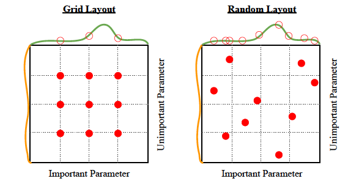

# W1D4 Part 2 - Hyperparameter Search

In this section we'll set up an experiment logging service, and spend the remainder of the day running experiments using your ResNet and Adam implementations on CIFAR10. Try various ideas to bring up your accuracy and bring down your training time.

Don't peek at what other people online have done for CIFAR10 (it's a common benchmark), because the point is to develop your own process by which you can figure out how to improve your model. Just reading the results of someone else would prevent you from learning how to get the answers. To get an idea of what's possible: using one V100 and a modified ResNet, one entry in the DAWNBench competition was able to achieve 94% test accuracy in 24 epochs and 76 seconds. 94% is approximately [human level performance](http://karpathy.github.io/2011/04/27/manually-classifying-cifar10/).

## Table of Contents

- [Weights and Biases Setup](#weights-and-biases-setup)
- [Grid Search and Random Search](#grid-search-and-random-search)
- [Modeling Hyperparameter Response](#modeling-hyperparameter-response)
- [Adaptive Search](#adaptive-search)
- [Some Experiments to Try](#some-experiments-to-try)
- [Using Weights and Biases for Hyperparameter Search](#using-weights-and-biases-for-hyperparameter-search)
- [While Your Search Runs](#while-your-search-runs)
- [The Optimizer's Curse](#the-optimizers-curse)
- [Bonus](#bonus)

## Weights and Biases Setup

Weights and Biases is a cloud service that allows you to log data from experiments. You can upload your model files to it, and it keeps track of what Git commit was used so you can match the model file to the code. Your logged data is shown in graphs during training, and you can easily compare logs across different runs.

Nothing about this is hard technically or conceptually, so we won't bother building our own and will just use this one throughout the remainder of the course to keep things organized.

To integrate with the service, copy the below code into a script, and modify the imports to use your own ResNet and Adam implementations from previously. Run the script from the command line and follow the instructions to register a personal account on the website and log in. Once the model is training, verify that you can see data appearing on the website.

Note that this looks basically identical to our training loop from W1D2, with a few calls to the `wandb` library sprinkled in. We call `wandb.init` passing in our dictionary of config options, which will be converted to an object and logged to the server. Then we do regular training stuff, calling `wandb.log` to save metrics and finally `wandb.save` to upload our trained model to the server.

## Grid Search and Random Search

One way to do hyperparameter search is to choose a set of values for each hyperparameter, and then search all combinations of those specific values. This is called **grid search**. The values don't need to be evenly spaced and you can incorporate any knowledge you have about plausible values from similar problems to choose the set of values. Searching the product of sets takes exponential time, so is really only feasible if there are a small number of hyperparameters. I would recommend forgetting about grid search if you have more than 3 hyperparameters, which in deep learning is "always".

A much better idea is for each hyperparameter, decide on a sampling distribution and then on each trial just sample a random value from that distribution. This is called **random search** and back in 2012, you could get a [publication](https://www.jmlr.org/papers/volume13/bergstra12a/bergstra12a.pdf) for this. The diagram below shows the main reason that random search outperforms grid search. Empirically, some hyperparameters matter more than others, and random search benefits from having tried more distinct values in the important dimensions, increasing the chances of finding a "peak" between the grid points.

<p align="center">
    
</p>

It's worth noting that both of these searches are vastly less efficient than gradient descent at finding optima - imagine if you could only train neural networks by randomly initializing them and checking the loss! Either of these search methods without a dose of human (or eventually AI) judgement is just a great way to turn electricity into a bunch of models that don't perform very well.

## Modeling Hyperparameter Response

In grid and random search, the machine just collects data and the human is responsible for detecting patterns and generalizing to unseen hyperparameter values. But the whole point of ML is to get the machine to detect patterns and generalize for us, so we might hope to train a hyper-model to predict validation set loss as a function of hyperparameter values. The main challenges are:

- Now your hyper-model has hyper-hyperparameters to tune.
- Validation set loss is a noisy metric because of the randomness in initialization and training.
- It's computationally expensive to gather hyper-training data because each (hyperparameter, loss) data point requires training the base model.
- In deep learning, there are so many hyperparameters that it's infeasible to test even two values for each one.

We won't be trying this today, but it's a possible approach.

## Adaptive Search

Instead of just collecting random samples, it would be nice to be able to use the results of early samples to inform which hyperparameter combinations to try next. This is possible if and only if there's some nice structure present in the problem; otherwise random search is actually just optimal and we shouldn't waste time trying to be smart about it.

The most basic sort of structure that we could hope for is that the validation loss is smooth for small perturbations of the hyperparameters: for example if a learning rate of 0.020 is good, then we assume that 0.019 and 0.021 should be not too different.

This is enough to be able to trade off choosing to sample far away from previous tests (exploration) with taking samples close to previous good outputs (exploitation). [Bayesian Optimization](https://scikit-optimize.github.io/stable/) is a way to do this. Another way to use this smoothness assumption is [LIPO](http://blog.dlib.net/2017/12/a-global-optimization-algorithm-worth.html), which explicitly maintains a bound on the Lipschitz constant of the function. The authors claim that LIPO is provably at least as good as random search, which is something.

Start with random search, but feel free to play with some of these methods later in the day and compare how well they work. In practice, I've usually found exciting-sounding methods to not work as well as I'd hope.

## Some Experiments to Try

- First, try to reduce training time.
    - Starting with a smaller ResNet is a good idea. Good hyperparameters on the small model tend to transfer over to the larger model because the architecture and the data are the same; the main difference is the larger model may require more regularization to prevent overfitting.
    - Bad hyperparameters are usually clearly worse by the end of the first 1-2 epochs. If you can train for fewer epochs, you can test more hyperparameters with the same compute. You can manually abort runs that don't look promising, or you can try to do it automatically; [Hyperband](https://www.jmlr.org/papers/volume18/16-558/16-558.pdf) is a popular algorithm for this.
    - Play with optimizations like [Automatic Mixed Precision](https://pytorch.org/docs/stable/amp.html) to see if you get a speed boost.
- Random search for a decent learning rate and batch size combination that allows your model to mostly memorize (overfit) the training set.
    - It's better to overfit at the start than underfit, because it means your model is capable of learning and has enough capacity.
    - Learning rate is often the most important single hyperparameter, so it's important to get a good-enough value early.
    - Eventually, you'll want a learning rate schedule. Usually, you'll start low and gradually increase, then gradually decrease but many other schedules are feasible. [Jeremy Jordan](https://www.jeremyjordan.me/nn-learning-rate/) has a good blog post on learning rates.
    - Larger batch size increases GPU memory usage and doubling batch size [often allows doubling learning rate](https://arxiv.org/pdf/1706.02677.pdf), up to a point where this relationship breaks down. The heuristic is that larger batches give a more accurate estimate of the direction to update in. Note that on the test set, you can vary the batch size independently and usually the largest value that will fit on your GPU will be the most efficient.
- Add regularization to reduce the amount of overfitting and train for longer to see if it's enough.
    - Data augmention is the first thing to do - flipping the image horizontally and Cutout are known to be effective.
    - Play with the label smoothing parameter to [torch.nn.CrossEntropyLoss](https://pytorch.org/docs/stable/generated/torch.nn.CrossEntropyLoss.html).
    - Try adding weight decay to Adam. This is a bit tricky - see this [fast.ai](https://www.fast.ai/2018/07/02/adam-weight-decay/) article if you want to do this, as well as the [PyTorch pseudocode](https://pytorch.org/docs/stable/generated/torch.optim.AdamW.html).
- Try a bit of architecture search: play with various numbers of blocks and block groups. Or pick some fancy newfangled nonlinearity and see if it works better than ReLU.
- Random search in the vicinity of your current hyperparameters to try and find something better.

## Using Weights and Biases for Hyperparameter Search

Have a look at the file `w1d4_sweep.yaml`. This contains the configuration for our sweep in the [Weights and Biases sweep configuration](https://docs.wandb.ai/guides/sweeps/configuration) format. We've chosen a log-uniform sampling distribution, meaning that the logarithm of the sampled values has a uniform distribution. This is appropriate when the values vary over multiple orders of magnitude. In addition, we're quantizing the batch size to a multiple of 8 in the hopes that this is slightly more efficient on the GPU. Change the 'program' argument to the name of your script file.

1) Run `wandb sweep .\w1d4_sweep.yaml`, which should print out a sweep ID and a URL where you can view the results. If you like, find a neighbouring pair and join their sweep instead so you can pool your results.
2) Run `wandb agent SWEEP_ID`, passing the sweep ID from step 1.

At the command line, you can run `nvidia-smi -l 1` to see your GPU memory usage and % utilization. Our model is pretty small, so GPU memory permitting you can launch multiple copies of `wandb agent` and they can run concurrently. If you happen to have other devices with GPUs available, they can launch `wandb agent` as well. Training on CPU only is likely to be too slow and not worth it.

## While Your Search Runs

An important part of a ML workflow is finding something useful to do while you're waiting for experiments to run. Some good ideas are to get started coding the next experiment, or reading relevant resources online.

## The Optimizer's Curse

The [optimizer's curse](https://www.lesswrong.com/posts/5gQLrJr2yhPzMCcni/the-optimizer-s-curse-and-how-to-beat-it) applies to tuning hyperparameters. The main take-aways are:

- You can expect your best hyperparameter combination to actually underperform in the future. You chose it because it was the best on some metric, but that metric has an element of noise/luck, and the more combinations you test the larger this effect is.
- Look at the overall trends and correlations in context and try to make sense of the values you're seeing. Just because you ran a long search process doesn't mean your best output is really the best.

For more on this, see [Preventing "Overfitting" of Cross-Validation Data](https://ai.stanford.edu/~ang/papers/cv-final.pdf) by Andrew Ng.


```python
import argparse
import os
import time
from typing import Any
import torch as t
from torch.utils.data import DataLoader
from tqdm.auto import tqdm
import wandb
from w1d2_solution import IS_CI, ResNet34, get_cifar10
from w1d4_part1_solution import Adam

MAIN = __name__ == "__main__"
IS_CI = os.getenv("IS_CI")
device = t.device("cuda" if t.cuda.is_available() else "cpu")


def train(config_dict: dict[str, Any]):
    wandb.init(project="w1d4", config=config_dict)
    config = wandb.config
    print(f"Training with config: {config}")
    (cifar_train, cifar_test) = get_cifar10()
    trainloader = DataLoader(cifar_train, batch_size=config.batch_size, shuffle=True, pin_memory=True)
    testloader = DataLoader(cifar_test, batch_size=1024, pin_memory=True)
    model = ResNet34(n_blocks_per_group=[1, 1, 1, 1], n_classes=10).to(device).train()
    optimizer = Adam(
        model.parameters(), lr=config.lr, betas=(config.beta_0, config.beta_1), weight_decay=config.weight_decay
    )
    train_loss_fn = t.nn.CrossEntropyLoss()
    wandb.watch(model, criterion=train_loss_fn, log="all", log_freq=10, log_graph=True)
    start_time = time.time()
    examples_seen = 0
    for epoch in range(config.epochs):
        for (i, (x, y)) in enumerate(tqdm(trainloader)):
            x = x.to(device)
            y = y.to(device)
            optimizer.zero_grad()
            y_hat = model(x)
            loss = train_loss_fn(y_hat, y)
            acc = (y_hat.argmax(dim=-1) == y).sum() / len(x)
            loss.backward()
            optimizer.step()
            wandb.log(dict(train_loss=loss, train_accuracy=acc, elapsed=time.time() - start_time), step=examples_seen)
            examples_seen += len(x)
    test_loss_fn = t.nn.CrossEntropyLoss(reduction="sum")
    with t.inference_mode():
        n_correct = 0
        n_total = 0
        loss_total = 0.0
        for (i, (x, y)) in enumerate(tqdm(testloader)):
            x = x.to(device)
            y = y.to(device)
            y_hat = model(x)
            loss_total += test_loss_fn(y_hat, y).item()
            n_correct += (y_hat.argmax(dim=-1) == y).sum().item()
            n_total += len(x)
        wandb.log(dict(test_loss=loss_total / n_total, test_accuracy=n_correct / n_total, step=examples_seen))
    filename = f"{wandb.run.dir}/model_state_dict.pt"
    t.save(model.state_dict(), filename)
    wandb.save(filename)


if MAIN and (not IS_CI):
    parser = argparse.ArgumentParser()
    parser.add_argument("--lr", type=float, default=0.001)
    parser.add_argument("--batch_size", type=int, default=1024)
    parser.add_argument("--weight_decay", type=float, default=0)
    parser.add_argument("--epochs", type=int, default=1)
    parser.add_argument("--beta_0", type=float, default=0.9)
    parser.add_argument("--beta_1", type=float, default=0.999)
    parser.add_argument("--cuda_memory_fraction", type=float, default=0.5)
    args = parser.parse_args()
    config_dict = vars(args)
    if t.cuda.is_available():
        t.cuda.set_per_process_memory_fraction(config_dict.pop("cuda_memory_fraction"))
    train(config_dict)

```

## Bonus

There's a saying: "Art is never finished, only abandoned". Hyperparameter tuning is also never finished, only abandoned. Play around until you're bored or run out of compute, and go back and do the Part 1 bonus if you like.
