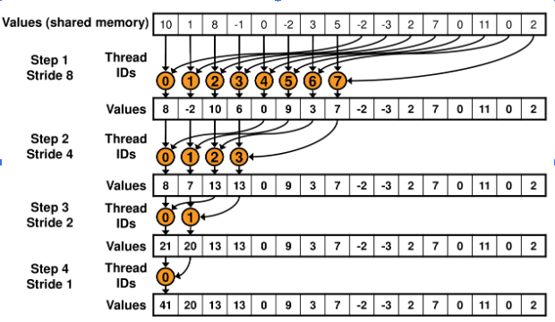

# W1D6 CUDA Day

CUDA is the API for executing code on Nvidia GPUs. There are other APIs for other hardware like AMD GPUs or Google's TPUs, but the principles are largely the same. A lot of PyTorch consists of CUDA code just like you're going to write today.

Today we'll learn how to write CUDA kernels using the PyCUDA library.  This library allows us to call everything in CUDA, without having to write a bunch of gnarly C/C++ code. Particularly, PyCUDA will take care of initializing the device and cleaning up resources after we're done with them.

CUDA is based on C/C++, and if you haven't written any C/C++ before, this day will be more challenging. I've tried to give context and make things approachable, but don't be afraid to look at solutions and if you're frustrate and not having fun, go do something else!

In contrast, if you've done a lot of low-level stuff then this day might be too easy - blast through the material and then pick some tricky bonus material to challenge yourself :)

You will want to install the VS Code extension [Nsight Visual Studio Code Edition](https://marketplace.visualstudio.com/items?itemName=NVIDIA.nsight-vscode-edition) which provides autocomplete for CUDA files with the `.cu` extension.

## Table of Contents

- [Readings](#readings)
- [CUDA Asserts](#cuda-asserts)
- [Debugging CUDA - Tips from Ryan Greenblatt, Resident CUDA Expert](#debugging-cuda---tips-from-ryan-greenblatt-resident-cuda-expert)
- [Running Your First Kernel](#running-your-first-kernel)
    - [__global__](#global)
    - [Floating Point Data Types](#floating-point-data-types)
    - [What does the asterisk mean next to the type?](#what-does-the-asterisk-mean-next-to-the-type)
    - [No Return Types](#no-return-types)
    - [`threadidx.x`](#threadidxx)
    - [const](#const)
    - [Running the Kernel](#running-the-kernel)
- [Writing Your First Kernel: A * B + C](#writing-your-first-kernel-a--b--c)
- [Summing An Array With Atomics](#summing-an-array-with-atomics)
    - [Multiple Blocks](#multiple-blocks)
- [Filtering an Array With Atomics](#filtering-an-array-with-atomics)
- [Indexing](#indexing)
    - [Error Handling with Printf](#error-handling-with-printf)
- [Benchmarking](#benchmarking)
- [Sum of Rows](#sum-of-rows)
- [Sum of Rows - Performance](#sum-of-rows---performance)
- [Summing an 1D Array Faster](#summing-an-d-array-faster)
    - [Block-Level Synchronization](#block-level-synchronization)
    - [Block-Shared Memory](#block-shared-memory)
    - [Summing Faster - Multiple Blocks](#summing-faster---multiple-blocks)
    - [Summing Faster - Multiple Launches](#summing-faster---multiple-launches)
- [Bonus](#bonus)
    - [Winograd Convolution](#winograd-convolution)
    - [Summing Even Faster](#summing-even-faster)
    - [Warp level Synchronization](#warp-level-synchronization)
    - [Block Reducing Faster](#block-reducing-faster)
    - [Filtering Faster Than PyTorch](#filtering-faster-than-pytorch)
    - [Filtering While Preserving Ordering](#filtering-while-preserving-ordering)
    - [Reduce-By-Key With Autograd Integration](#reduce-by-key-with-autograd-integration)
    - [Efficient Matrix Transpose](#efficient-matrix-transpose)
    - [Pointer Aliasing and `__restrict__`](#pointer-aliasing-and-restrict)
    - [Reading PyTorch Kernels](#reading-pytorch-kernels)
    - [Reading Efficient Matrix Multiply on Tensor Cores](#reading-efficient-matrix-multiply-on-tensor-cores)
    - [Loop Unrolling](#loop-unrolling)

## Readings

- [CUDA C++ Programming Guide](https://docs.nvidia.com/cuda/cuda-c-programming-guide/index.html) - Sections 1 and 2 give some basic context on the differences between CPU and GPU programming.


## CUDA Asserts

If you see the message `CUDA error: device-side assert triggered`, this means there was an error in your kernel but CUDA doesn't want to tell you what it is. You need to restart your notebook or you'll keep seeing this every time you do a CUDA operation.


## Debugging CUDA - Tips from Ryan Greenblatt, Resident CUDA Expert

You can skip reading this section until you have a bug that you are struggling with.

Here's a ordered checklist to go through when debugging cuda (crashes or incorrect output):
* Reduce to the minimal input. Does this make it obvious what the issue is? Does it fail only when the size isn't a multiple of the block size?
* Illegal memory error? Make sure to check your allocations are the right size, that pointers are for the correct device, and the bounds on your indexes. If using a notebook or interactive session, you must restart the session after encountering this error to clear the error.
* Consider adding asserts to validate assumptions about your code - add "#include <cassert>" and then use assert(condition).
* Are things off by a seemingly random amount? Perhaps you failed to initialize to 0 and are using garbage memory.
* Is the failure/error non-deterministic? The issue could be related to synchronization or reading something while another thread is writing. So look through and try to see if there are any obvious places where synchronization is missing.
* Think about your algorithm. If there were to be a problem, what section of code is most error-prone or likely to be wrong?
* Print your inputs, outputs and expected outputs. Use printf strategically within the kernel - the kernel will crash if you print too much because printf has a limited buffer. If print statements upset the timing and cause the issue to no longer occur, try saving values to array and then printing at the end of the kernel. Saving to an array is much faster, so it shouldn't upset timing much.
* Load your printed data into Python to manipulate it and see if the values make sense at a given point.
* Call a TA at this point :)

Advanced: the `cuda-gdb` debugger exists but is sometimes buggy, and we won't go through how to use it here.


```python
import os
import sys
from functools import partial
from typing import Any, Callable

IS_CI = os.getenv("IS_CI")
if IS_CI:
    sys.exit(0)

```
Windows users have to do some more work for the compiler toolchain. Ask a TA if you're getting errors!


```python
if sys.platform == "win32":
    CL_EXE_FOLDER = (
        "C:/Program Files (x86)/Microsoft Visual Studio/2017/Community/VC/Tools/MSVC/14.16.27023/bin/Hostx64/x64"
    )
    os.environ["PATH"] = f"{os.environ['PATH']};{CL_EXE_FOLDER}"
    os.environ["CUDA_PATH"] = "C:/Users/Chris/miniconda3/Library/"
import numpy as np
import torch as t
import utils
from w1d6_utils import Holder, ceil_divide, load_module

device = t.device("cuda:0")

```

## Running Your First Kernel

Have a look at `w1d6_kernels/intro.cu`. CUDA source code is processed by the CUDA compiler using the syntax of C++, with some caveats. If you are a C++ guru, refer to [page 318 of the CUDA C++ Programming Guide](https://docs.nvidia.com/cuda/pdf/CUDA_C_Programming_Guide.pdf) if you're unsure what you can and can't do in CUDA. If not, don't worry - we'll attempt to explain everything you need for the exercises as it comes up.

### __global__

The `__global__` specifier means the function will be executed on the GPU, and can be called from the GPU or the host. The host refers to your CPU. The alternatives are `__device__` which means the function can only be executed and called from the GPU, and `__host__` which means the function can only be executed and called from the host.

### Floating Point Data Types

The type `float` is equivalent to `t.float32`. The type `double` is equivalent to `t.float64`. We're going to stick to these two for today.

Reduced precision types like `__half` which is like `t.float16` are [more complicated](https://ion-thruster.medium.com/an-introduction-to-writing-fp16-code-for-nvidias-gpus-da8ac000c17f) to play with these, so ignore them for now.

### What does the asterisk mean next to the type?

The asterisk means that this is actually a memory address, and that the bytes  which refers to one, or more floats. How many floats? In C, you don't get to know this unless you pass the length as a separate argument.

### No Return Types

CUDA kernels always run asynchronously, which means your Python code will start them and then can do something else while they're executing. As such, CUDA kernels never return a value and can only interact with the world by writing to memory.

### `threadidx.x`

When you run a CUDA kernel, all the threads run the same function and the only difference is the values they get for the `threadIdx` structure. We'll explain this more as it comes up.

### const

A variable `const i` means that you're not allowed to change `i` after it's defined. `const float *a` means something different - you're not allowed to use the pointer to write to memory.

The benefits of marking things as `const` are:

- You'll get a compiler error if you try to misuse it
- In some cases, it enables the compiler to do optimizations for you
- It makes your code more self-documenting

### Running the Kernel

PyCuda has a concept of a `SourceModule`, which is returned from `load_module`. `SourceModule` takes your source code, compiles it with `nvcc`, and links against the CUDA runtime.


```python
mod = load_module("w1d6_kernels/intro.cu")
zero_kernel = mod.get_function("zero")
one_kernel = mod.get_function("one")
dest = t.ones(128, dtype=t.float32, device=device)
zero_kernel(Holder(dest), block=(64, 1, 1), grid=(1, 1))

```

Again, kernels run asynchronously by default. The call to `zero_kernel` returns as soon as the operation is enqueued on the GPU, but `dest` isn't guaranteed to be updated unless we call `synchronize`.

Exercise: what happens if you make `dest` of dtype `float16` instead?

<details>

<summary>Solution - wrong dtype</summary>

There is no typechecking, so the CUDA code just treats each pair of adjacent `float16` as a single `float32`. It's very easy to mix up dtypes and get completely nonsensical results in CUDA.

</details>


```python
t.cuda.synchronize()
print(dest)

```

## Writing Your First Kernel: A * B + C

Make a new `.cu` file and change the filename below to load your file with `load_module`. Write a kernel that will take four float array arguments `dest`, `a`, `b`, `c` of fixed length 128, and compute `dest = a * b + c`. Launch your kernel with one block and an appropriate number of threads, and verify that the answer matches the same computation done using PyTorch.


```python
filename = "w1d6_kernels/abc.cu"
mul_add_kernel = load_module(filename).get_function("mul_add")
size = 128
dest = t.empty(size, dtype=t.float32, device=device)
a = t.arange(size, dtype=t.float32, device=device)
b = t.arange(0, 4 * size, 4, dtype=t.float32, device=device)
c = t.arange(3, size + 3, dtype=t.float32, device=device)
"TODO: YOUR CODE HERE"
t.cuda.synchronize()
utils.allclose(dest, a * b + c)

```

Exercise: does your kernel work for an array of size 1025?

<details>

<summary>Solution</summary>

This is an error - each block is limited to a maximum of 1024 threads (512 on GPUs released before March 2010).

Additional limitations are:

- threadIdx.z is at most 64
- blockIdx.x is at most 2^31 - 1
- blockIdx.y and blockIdx.z are at most 65535

</details>


## Summing An Array With Atomics

Python integers are always signed and automatically expand to fit any value, given sufficient memory. For example, it's no problem to store $2^128$ in a Python integer.

In CUDA as in C, the built-in integer types have fixed sizes and have signed and unsigned variants. The behavior of these types are [exceedingly complicated](https://www.nayuki.io/page/summary-of-c-cpp-integer-rules). Feel free to read the article in detail if you want to be grateful for the convenience of Python's integers. Otherwise, the main take-aways you'll need today are:

- Overflow on an unsigned integer is guaranteed to wrap around.
- Overflow on a signed integer is "undefined behavior", which means the compiler is technically allowed to delete all your files and light your CPU on fire.
- Implicit conversions area allowed almost everywhere and commonly cause bugs.


For CUDA on Windows or Linux, it's safe to assume that `char`, `short`, and `int` are 8, 16, and 32 bits respectively.

For a long time, 32 bits was plenty to represent the number of elements in a tensor, but GPU memory is increasing and conceivably you might want to operate on individual tensors with billions of elements.

The most robust approach is to `#include <cstdint>` at the top of your `.cu`, which enables you to use [precisely specified types like](https://en.cppreference.com/w/c/types/integer) `int64_t`, which is a signed integer of exactly 64 bits regardless of platform. You can convert a value to `int64_t` like this: `static_cast<int64_t>(blockIdx.x)`.

For today, we won't need to operate on tensors that large, so it's fine to use `int` for counters and lengths. You can also use `int64_t` if you prefer.

### Multiple Blocks

Create and load a new kernel that takes:

- a float tensor with any shape containing the input to be summed
- An integer of appropriate type containing the number of elements in the input tensor
- a scalar float tensor to hold the total.

Each thread should read a value and use [atomicAdd](https://docs.nvidia.com/cuda/cuda-c-programming-guide/index.html#atomic-functions) to add that value to the output element.

Compute the number of blocks necessary to read all elements using `ceil_divide` from the provided utils. Your kernel should check that it isn't reading past the end of the input array. Note that CUDA has no idea about multidimensional tensors; regardless of the number of dimensions in the tensor, CUDA just sees a flattened 1D array.

Due to floating point rounding, the result might not be exactly the same.


```python
filename = "w1d6_kernels/sum_atomic.cu"
sum_atomic_kernel = load_module(filename).get_function("sum_atomic")


def sum_atomic(inp: t.Tensor, dest: t.Tensor, block_size: int = 1024) -> None:
    """Call sum_atomic_kernel to sum inp into dest.

    inp: shape (*) input to be summed
    dest: shape ()
    """
    assert block_size <= 1024
    pass


inp = t.randn(256, 256, 3).to(device=device)
dest = t.tensor(0.0).to(device=device)
sum_atomic(inp, dest)
t.cuda.synchronize()
expected = inp.sum()
actual = dest
print(actual, expected)
utils.allclose_scalar(actual.item(), expected.item())
print("OK!")

```

## Filtering an Array With Atomics

Our next kernel will take a 1D array of floats, a size, a destination array of equal size to the input initialized to zero, a float threshold value, and a 1-element integer tensor called "counter" that is initialized to zero. It will copy to the destination all input elements with an absolute value less than the threshold (use `std::abs`).

We don't require that the destination elements are in the same order.

<details>

<summary>Hint - implementation</summary>

The function `atomicAdd` returns the old value. How can you use this return value?

</details>

<details>

<summary>Solution - implementation</summary>

We can add 1 to our counter and use the returned value as an index. These returned indexes won't have gaps and are guaranteed to be unique.

</details>

Test your function. How do we know how many elements were copied? We don't require this, but are the copied elements in fact in the same order as they were in the input?


```python
filename = "w1d6_kernels/filter_atomic.cu"
filter_atomic_kernel = load_module(filename).get_function("filter_atomic")


def filter_atomic(inp: t.Tensor, dest: t.Tensor, thresh: float, block_size: int = 512) -> t.Tensor:
    """Write only elements with absolute value strictly less than thresh into dest, in no particular order.

    inp: shape (N, )
    dest: shape (N, )

    Return: a slice of dest containing only the copied elements (not the zero padding at the end)
    """
    atomic = t.zeros(1, dtype=t.int32, device=inp.device)
    filter_atomic_kernel(
        Holder(inp),
        Holder(dest),
        Holder(atomic),
        np.int32(inp.size(0)),
        np.float32(thresh),
        block=(block_size, 1, 1),
        grid=(ceil_divide(inp.size(0), block_size), 1),
    )
    return dest[:atomic]


N = 2048
threshold = 512
inp = t.randint(-N // 2, N // 2, (N,), dtype=t.float32, device=device)
dest = t.zeros(N, dtype=t.float32, device=device)
filtered = filter_atomic(inp, dest, float(threshold))
t.cuda.synchronize()
assert (filtered.abs() < threshold).all()
print("Number of filtered elements (random but should be reasonable): ", len(filtered))

```

## Indexing

Now let's create a kernel that computes `dest[i] = a[b[i]]`. The sizes of `dest` and `b` must be equal, but the size of `a` can differ.

### Error Handling with Printf

If some index in `b` is outside the bounds of `a`, your kernel should use `printf()` to display an error and then return without modifying that element of `dest`. Test that your function behaves properly with various indexes that are out of bounds.

Note that this is NOT the behavior of `a[b[i]]` in PyTorch, which happily accepts negative indexes.

The GPU buffer for `printf()` has a limited size and your kernel can crash if you try to print too many characters.


```python
filename = "w1d6_kernels/index.cu"
index_kernel = load_module(filename).get_function("index")


def index(a: t.Tensor, b: t.Tensor, dest: t.Tensor, block_size=512) -> None:
    """Write dest[i] = a[b[i]] in place.

    a: shape (A, ), float32
    b: shape (B, ), int64
    dest: shape (B, ), float32
    """
    assert b.shape == dest.shape
    pass


aSize = 10
bSize = 100
a = t.randn(aSize, device=device)
b = t.randint(-aSize, aSize, size=(bSize,), dtype=t.int64, device=device)
dest = t.zeros(bSize, device=device)
index(a, b, dest)
t.cuda.synchronize()
expected = a[b]
expected[(b < 0) | (b >= aSize)] = 0
utils.allclose(dest, expected)

```

## Benchmarking

PyTorch has its own benchmarking system, but we will implement our own simple system to understand some of the considerations.

The main thing is that the first time you call a function, it might need to "warm up", which encompasses any initialization code on the GPU like loading libraries, compiling kernels, or building caches.

For the case of convolutions specifically, if `torch.backends.cudnn.benchmark` is True then an auto-tuner will run that benchmarks multiple convolution algorithms on your specific GPU and picks the best ones for various input sizes.

Implement benchmark so it runs `func` at least once for warmup (superstition says to warmup 3 times for good luck) and then use `time.perf_counter` to measure the time per iteration.

Exercise: should you `synchronize` after each iteration, or at the end of all iterations, or are both equivalent?

<details>

<summary>Solution - Synchronization</summary>

If you synchronize only at the end of all iterations, then the calls can potentially overlap in execution. This usually isn't what you want.

</details>

How much slower is your sum kernel than PyTorch's on GPU? We'll improve the speed of our kernel in later sections.


```python
import time


def benchmark(func: Callable[[], Any], n_iters: int = 10) -> float:
    """Warmup, then call func "n_iters" times and return the time per iteration."""
    pass


def benchmark_my_sum_atomic(inp):
    dest = t.tensor(0.0).to(device=device)
    sum_atomic(inp, dest)


def benchmark_pytorch_sum_atomic(inp):
    dest = inp.sum()


inp = t.randn(1024, 1024, 256).to(device=device)
n_iters = 10
ref = benchmark(partial(benchmark_pytorch_sum_atomic, inp), n_iters=n_iters)
print(f"PyTorch: {ref:.3f}s")
yours = benchmark(partial(benchmark_my_sum_atomic, inp), n_iters=n_iters)
print(f"Yours: {yours:.3f}s")

```

## Sum of Rows

We've only worked in one dimension so far, and even if we passed in a tensor with more dimensions, the kernel just treated it as 1D.

Now implement the operation `dest = inp.sum(1)` which sums out the row dimension.

- It's up to you to manually compute the index into the storage for some (col, row) index.
- Each thread is responsible for one element of the output. No atomics are needed.
- You only have to handle the case of contiguous input.


```python
filename = "w1d6_kernels/sum_rows.cu"
sum_rows_kernel = load_module(filename).get_function("sum_rows")


def sum_rows(inp: t.Tensor, dest: t.Tensor, block_size=1024):
    """Write the sum of each row to the corresponding element of dest."""
    assert inp.is_contiguous()
    assert dest.is_contiguous()
    (C, R) = inp.shape
    assert dest.shape == (C,)
    pass


nCols = 200
nRows = 300
inp = t.rand((nCols, nRows), device=device, dtype=t.float32)
dest = t.zeros(nCols, device=device, dtype=t.float32)
sum_rows(inp, dest)
t.cuda.synchronize()
expected = inp.sum(dim=1)
utils.allclose(dest, expected)

```

## Sum of Rows - Performance

Exercise: which of `inp1` and `inp2` should take less time to sum on the GPU? Should it be a big difference or a small difference?

<details>

<summary>Solution - Sum Rows Performance</summary>

For `inp2`, only 10 threads can execute at once. For `inp1`, a GPU like the A100 can schedule up to 2048 threads on each of 108 streaming multiprocessors.

However, it won't be 5 orders of magnitude faster because the memory bandwidth will run out first and most of these threads will have to sleep.

</details>


```python
inp1 = t.randn((10000000, 10), device=device)
inp2 = t.randn((10, 10000000), device=device)
dest1 = t.zeros(inp1.shape[0], device=inp1.device)
dest2 = t.zeros(inp2.shape[0], device=inp2.device)
n_iters = 10
cols = benchmark(partial(sum_rows, inp1, dest1), n_iters=n_iters)
print(f"Many columns: {cols:.3f}s")
rows = benchmark(partial(sum_rows, inp2, dest2), n_iters=n_iters)
print(f"Many rows: {rows:.3f}s")

```

## Summing an 1D Array Faster

The bottleneck in `sum_atomic` was that only one thread on the entire device can be atomically updating the destination counter at once, forcing the others to pile up and wait.

It would be better if each block could operate independently, and we could choreograph our threads within a block to cooperately without using `atomicAdd` at all. We're going to implement a new algorithm for a single fixed size block, and then we'll work up to handling any size of input array.

The diagram below shows our new algorithm with 8 threads:



### Block-Level Synchronization

`__syncthreads()` makes the calling thread sleep until all threads **in the same block** have called `__syncthreads()`. This is how we'll enforce that all threads have completed writes in "Step 1" of the diagram before any perform reads for "Step 2".

It's your responsibility to prevent deadlock by ensuring that all the threads really make the call, even if they are otherwise not needed for anything. It was fine to return early in previous kernels, but now every thread has to keep running until all calls to `__syncthreads()` are done.

### Block-Shared Memory

We've been reading and writing to global memory, but each block has a limited amount of "shared memory" which is much faster. Declare a fixed size shared memory buffer like this: `static __shared__ float data[1024]`.

To keep it simple, we're going to assert that 1024 threads per block really are used, and not support any other sizes. To remove this limitation, you could use C++ templates or code generation to generate a separate kernel for 512 threads, but this isn't necessary today.

<details>

<summary>Optional - I think C++ templates are awesome and I want to use them everywhere. How?</summary>

You can use regular template syntax like `template <int block_size>`, but you'll need some boilerplate to instantiate them like this:

```cpp

extern "C" {
    sum_block_kernel_512(...) {
        sum_block<512>(...);
    }
    sum_block_kernel_1024(...) {
        sum_block<1024>(...);
    }
}
```

By default, PyCuda wraps your whole kernel in an `extern "C"` but since we're doing our own, you should pass `no_extern_c=True` to `load_module` to suppress the default behavior and then you should be able to call `sum_block_kernel_512` and `sum_block_kernel_1024` from Python.

Actual PyTorch uses [`pybind11`](https://github.com/pybind/pybind11) for the interface between Python and C++, which probably has a nicer way to handle this.

</details>

For more on shared memory, see [Using Shared Memory in CUDA C/C++](https://developer.nvidia.com/blog/using-shared-memory-cuda-cc/).

<details>

<summary>Spoiler - Pseudocode for Sum One Block</summary>

- Initialize your `__shared__` array and copy the input to it.
- In a loop, alternate between `__syncthreads()` and `data[i] += data[i + offset]`. Offset needs to start at half the block size and divide by 2 on each iteration.
- The sum ends up at the first element of the shared array. Choose one thread to copy the value to `dest`.

</details>


```python
filename = "w1d6_kernels/sum_fast.cu"
mod = load_module(filename)
sum_1024_kernel = mod.get_function("sum_1024")


def sum_one_block(inp: t.Tensor, dest: t.Tensor, block_size=1024):
    """Write the sum of inp to the first element of dest."""
    assert block_size == 1024, "Only 1024 supported for now"
    assert inp.shape == (block_size,), "inp must be 1D and exactly block_size for now"
    pass


inp = t.arange(1024, dtype=t.float32, device=device)
dest = t.zeros((1,), dtype=t.float32, device=device)
sum_one_block(inp, dest)
t.cuda.synchronize()
utils.allclose_scalar(dest.item(), inp.sum().item())

```

### Summing Faster - Multiple Blocks

Modify your code so it can run any number of blocks, and block `i` writes to `dest[i]`. Make sure you handle the last block, which might not have the full number of elements.

For example, if the input array is of length 10241, 11 blocks should be launched and 11 elements of `dest` should be written. The last block contains only 1 element.

<details>

<summary>I'm confused about handling the partial block!</summary>

When you initialize your temp array, just fill all positions past the end of the input with zero. Then proceed just like a normal block. This isn't quite optimal, but it's pretty close.

</details>


```python
def sum_n_blocks(inp: t.Tensor, dest: t.Tensor, block_size=1024):
    """Write the sum of the ith chunk of size block_size to dest[i].

    inp: shape (*) - will be treated as a flat 1D array.
    """
    assert block_size == 1024, "Only 1024 supported for now"
    pass


inp = t.arange(10241, dtype=t.float32, device=device)
dest = t.zeros((11,), dtype=t.float32, device=device)
expected = t.zeros_like(dest)
expected[:-1] = inp[:-1].reshape((10, 1024)).sum(-1)
expected[-1] = inp[-1]
sum_n_blocks(inp, dest)
t.cuda.synchronize()
utils.allclose(dest, expected)

```

### Summing Faster - Multiple Launches

Write a function on the Python side that takes an input array of variable size, and any number of dimensions (it will be treated as a flat 1D array). Each kernel launch will return an output that's smaller by a factor of 1024.

While the output size is larger than 1, just call the kernel again.

For 1024 threads per block and an input of size $2^29$, the first launch should take you to $2^19$, the second launch to $2^9$, and the third launch to the final output of size 1.

Benchmark your new sum function. Mine was about 50x faster than before, and only takes about 3x as long as PyTorch.


```python
def sum_final(inp: t.Tensor, block_size=1024) -> float:
    """Return the sum of inp by iteratively launching kernels.

    inp: shape (*) - will be treated as a flat 1D array.
    """
    assert block_size == 1024, "Only 1024 supported for now"
    pass


inp = t.arange(2**29, dtype=t.float32, device=device)
actual = sum_final(inp)
t.cuda.synchronize()
utils.allclose_scalar(actual, inp.sum().item())
inp = t.randn(1024, 1024, 256, device=device)
ref = benchmark(partial(sum_final, inp), n_iters=n_iters)
print(f"sum_final: {ref:.3f}s")

```

## Bonus

Congratulations, you've finished the main content for the day! There are more bonus exercises than you can reasonably complete in a day if this is your first time writing CUDA, so feel free to browse and pick ones that sound exciting!

### Winograd Convolution

Multiple algorithms are known for convolution, each with their own strengths and weaknesses. Our earlier implementation of convolution reduced the problem to batch matrix multiplication, which is one legitimate way to do it.

Surprisingly to me, it's possible to do better for convolutions with small filters like 3x3. Shmuel Winograd (not to be confused with the other computer scientist Terry Winograd) showed the way, which you can read about in [Fast Algorithms for Convolutional Neural Networks](https://arxiv.org/pdf/1509.09308.pdf).

The real cuDNN implements multiple algorithms including Winograd and one based on the Fast Fourier Transform. Part of what `torch.backends.cudnn.benchmark=True` does is test out the various algorithms on the current hardware to see which performs best.

Read about Winograd convolution in the paper and try implementing the basic ideas yourself.

### Summing Even Faster

Firstly, if you have some of your own ideas to optimize your summing kernel, try them out and benchmark!

If you want to see some other ideas, read [Optimizing Parallel Reduction in CUDA](https://developer.download.nvidia.com/assets/cuda/files/reduction.pdf).

### Warp level Synchronization

We gained speed from coordinating within a block instead of the entire device. The next level is to coordinate at an even more granular level. A warp is a set of 32 threads that can communicate even more quickly using the 'shfl' family of intrinsic functions.

Read [Faster Parallel Reductions on Kepler](https://developer.nvidia.com/blog/faster-parallel-reductions-kepler/) through the 'Shuffle Warp Reduce' section, but don't read the 'Block Reduce' as it has spoilers for a later bonus exercise.

The NVIDIA documentation on [Warp Shuffle Functions](https://docs.nvidia.com/cuda/cuda-c-programming-guide/#warp-shuffle-functions) will be useful.

Note that `__shfl_down` has been deprecated and replaced with `__shfl_down_sync`. For the mask input you can just input the full mask: `0xffffffff`.

Integrate warp functions into your block level summing function, then benchmark!

### Block Reducing Faster

Read the 'Block Reduce' and 'Reducing Layer Arrays' sections of [Faster Parallel Reductions on Kepler](https://developer.nvidia.com/blog/faster-parallel-reductions-kepler/).

Particularly take note of the trick of iterating by the total size covered by the grid (blockDim.x * gridDim.x). This is an efficient approach to use only 2 kernel launches without having to tune any parameters.

Consider also reading some of the discussion of atomics in that article and implementing that approach. Combining atomics with block wide reduction results in far fewer atomic collisions while also requiring only one kernel invocation. The overall performance should be similar.

### Filtering Faster Than PyTorch

Benchmark your atomic implementation - performance can vary based on the proportion of floats that pass the filter.

Ryan's implementation was able to beat PyTorch by quite a bit, while still being slower than other implementations like [Thrust](https://thrust.github.io/doc/group__stream__compaction_ga695e974946e56f2ecfb20e9ec4fb7cca.html).

Is yours faster? If so, speculate on a reason why (but you aren't likely to get it right unless you've written CUDA before).

<details>

<summary>Spoiler - Filtering</summary>

PyTorch does enforce that the input ordering is retained, which makes the problem a bit harder.

Beyond that, Ryan claimed that the compiler detected that [Warp-Aggregated Atomics](https://developer.nvidia.com/blog/cuda-pro-tip-optimized-filtering-warp-aggregated-atomics/) could be safely used, which reduces the number of atomics by up to 32 times - the threads in a warp coordinate and only one thread has to atomically increase the counter.

</details>

### Filtering While Preserving Ordering

The PyTorch implementation uses an "exclusive scan" approach. The idea is to compute an array `temp` with an array of 1 where the corresponding input element does pass the predicate, and 0 otherwise. Exclusive scan is an operation similar to `cumsum`, and after running this, `temp[i]` contains the number of items before index `i` that have passed the predicate. Finally, for each `i`, you can use `temp[i]` to determine the index into `dest` where `input[i]` should be copied. Try it out!

Advanced: you can use `shfl` operations to do scan within a warp. See [Inclusive plus-scan](https://docs.nvidia.com/cuda/cuda-c-programming-guide/#warp-examples-inclusive) for an example, though note that exclusive scan is slightly different.

### Reduce-By-Key With Autograd Integration

PyTorch doesn't provide the "reduce-by-key" scatter operation, but it is a handy one to have. The operation is included in the library [PyTorch-Scatter](https://pytorch-scatter.readthedocs.io/en/latest/functions/scatter.html) and the link has a nice diagram describing it.

Try implementing it using device-wide atomics to get a correct, but slow implementation.

To backprop through your new operation, you'll need to subclass `Function` from PyTorch and define the backward pass, similarly to what you did in W1D3. See [Extending PyTorch](https://pytorch.org/docs/stable/notes/extending.html) for documentation on doing this.

Note the backward pass can be implemented with just PyTorch built-ins; you won't need a separate kernel for the backwards pass.

A reference implementation you can look at is the one in [Thrust](https://thrust.github.io/doc/group__reductions_gad5623f203f9b3fdcab72481c3913f0e0.html).


### Efficient Matrix Transpose

Follow along with the blog post [An Efficient Matrix Transpose in CUDA C/C++](https://developer.nvidia.com/blog/efficient-matrix-transpose-cuda-cc/) and gain a better understanding of the performance implications of shared memory.

### Pointer Aliasing and `__restrict__`

Follow along with the blog post [CUDA Pro Tip: Optimize for Pointer Aliasing](https://developer.nvidia.com/blog/cuda-pro-tip-optimize-pointer-aliasing/). The article is old at this point - see how much difference using `__restrict__` makes on modern GPUs.

### Reading PyTorch Kernels

Have a look in the PyTorch source tree at some real production kernels. Many can be found under [aten/src/ATen/native/cuda](https://github.com/pytorch/pytorch/tree/master/aten/src/ATen/native/cuda). Try to understand how they balance performance with maintainability and support for many different dtypes.

Sadly, most of NVIDIA's kernels are closed source so we can't tell what they're doing in there.

### Reading Efficient Matrix Multiply on Tensor Cores

[NVIDIA Cutlass](https://github.com/NVIDIA/cutlass/blob/12f4108ac2233022b92f0e3533c23bed399fcf45/media/docs/efficient_gemm.md) is an open source implementation of various linear algebra functions.

Read at the link about what's needed to make matrix multiply fast on Tensor Cores.

### Loop Unrolling

In theory, the compiler should perform loop unrolling for you when applicable, but in practice it often doesn't. Try manually unrolling some of your loops and see if you can measure a performance difference. Or, inspect the generated code and see if you can see a difference there.

