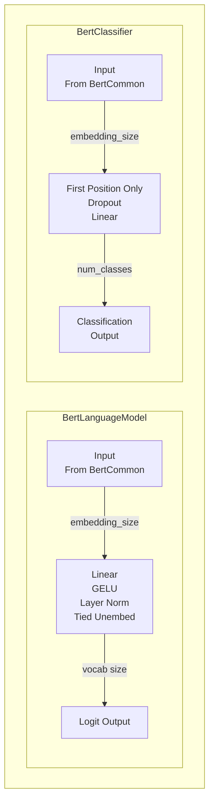
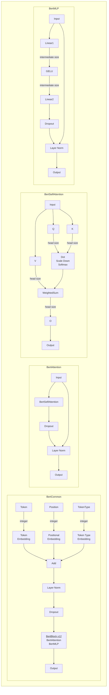

# Week 2 Day 1 - Build Your Own BERT

BERT (Bidirectional Encoder Representations from Transformers) is the most famous in a line of Muppet-themed language research, originating with [ELMo](https://arxiv.org/pdf/1802.05365v2.pdf) (Embeddings from Language Models) and continuing with a series of increasingly strained acronyms:

- [Big BIRD](https://arxiv.org/pdf/1910.13034.pdf) - Big Bidirectional Insertion Representations for Documents
- [Ernie](https://arxiv.org/pdf/1904.09223.pdf) - Enhanced Representation through kNowledge IntEgration
- [Grover](https://arxiv.org/pdf/1905.12616.pdf) - Generating aRticles by Only Viewing mEtadata Records
- [Kermit](https://arxiv.org/pdf/1906.01604.pdf) - Kontextuell Encoder Representations Made by Insertion Transformations

Today you'll implement your own BERT model such that it can load the weights from a full size pretrained BERT, and use it to predict some masked tokens.

## Table of Contents

- [Readings](#readings)
- [BERT architecture](#bert-architecture)
    - [Language model vs. classifier](#language-model-vs-classifier)
    - [Schematic](#schematic)
- [Batched Self-Attention](#batched-self-attention)
    - [Attention Pattern Pre-Softmax](#attention-pattern-pre-softmax)
    - [Attention Forward Function](#attention-forward-function)
- [Layer Normalization](#layer-normalization)
- [Embedding](#embedding)
- [BertMLP](#bertmlp)
- [Bert Block](#bert-block)
- [Putting it All Together](#putting-it-all-together)
    - [utils.StaticModuleList](#utilsstaticmodulelist)
- [BertLanguageModel](#bertlanguagemodel)
- [Loading Pretrained Weights](#loading-pretrained-weights)
- [Tokenization](#tokenization)
    - [Vocabulary](#vocabulary)
    - [Special Tokens](#special-tokens)
    - [Predicting Masked Tokens](#predicting-masked-tokens)
- [Model debugging](#model-debugging)

## Readings

- [Language Modelling with Transformers](https://docs.google.com/document/d/1XJQT8PJYzvL0CLacctWcT0T5NfL7dwlCiIqRtdTcIqA/edit#)

You don't need to read the other Muppet papers for today's content.

## BERT architecture

There are various sizes of BERT, differing only in the number of BERT transformer blocks ("BertBlock") and the embedding size. We'll be playing with [bert-base-cased](https://huggingface.co/bert-base-cased) today, which has 12 layers and an embedding size of 768. Note that the link points to Hugging Face, which provides a repository of pretrained models (often, transformer models) as well as other valuable documentation.

Refer to the below schematics for the architecture of BERT. Today we will be using BERT for language modelling, and tomorrow we will use it for classification. As most of the architecture is shared, we will be able to reuse most of the code as well.

### Language model vs. classifier



### Schematic

Note the "zoomed-in" view into `BertAttention` (and in turn, `BertSelfAttention`) as well as `BertMLP`.



# Implementation

We will begin by importing necessary modules and defining `BertConfig` to store the model architecture parameters. Review the list of config entries and consider what each one means, reviewing the reading to familiarize yourself with transformer models if necessary.


```python
import os
from dataclasses import dataclass
from typing import List, Optional, Union
import torch as t
import transformers
from einops import rearrange, repeat
from fancy_einsum import einsum
from torch import nn
from torch.nn import functional as F
import utils
import w2d1_test

MAIN = __name__ == "__main__"
IS_CI = os.getenv("IS_CI")


@dataclass(frozen=True)
class BertConfig:
    """Constants used throughout the Bert model. Most are self-explanatory.

    intermediate_size is the number of hidden neurons in the MLP (see schematic)
    type_vocab_size is only used for pretraining on "next sentence prediction", which we aren't doing.

    Note that the head size happens to be hidden_size // num_heads, but this isn't necessarily true and your code shouldn't assume it.
    """

    vocab_size: int = 28996
    intermediate_size: int = 3072
    hidden_size: int = 768
    num_layers: int = 12
    num_heads: int = 12
    head_size: int = 64
    max_position_embeddings: int = 512
    dropout: float = 0.1
    type_vocab_size: int = 2
    layer_norm_epsilon: float = 1e-12


if MAIN:
    config = BertConfig()

```

## Batched Self-Attention

We're going to implement a version of self-attention that computes all sequences in a batch at once, and all heads at once. Make sure you understand how single sequence, single head attention works first, again consulting the reading to review this mechanism if you haven't already done so.


### Attention Pattern Pre-Softmax

Write the attention_pattern_pre_softmax function as specified in the diagram.

The "Scale Down" factor means dividing by the square root of the head size. Empirically, this helps training. [This article](https://github.com/BAI-Yeqi/Statistical-Properties-of-Dot-Product/blob/master/proof.pdf) gives some math to justify this, but it's not important.

### Attention Forward Function

Your forward should call `attention_pattern_pre_softmax`, add the attention mask to the result if present, and then finish the computations using `einsum` and `rearrange` again. Remember to apply the output projection.


Spend 5 minutes thinking about how to batch the computation before looking at the spoilers below.

<details>

<summary>What should the shape of `project_query` be?</summary>

`project_query` should go from `hidden_size` to `num_heads * self.head_size`. In this case, the latter is equal to `hidden_size`. This represents all the heads's `Q` matrices concatenated together, and one call to it now computes all the queries at once (broadcasting over the leading batch and seq dimensions of the input `x`).

</details>

<details>

<summary>Should my Linear layers have a bias?</summary>

While these Linear layers are traditionally referred to as projections, and the BERT paper implies that they don't have a bias, in the official reference implementation of BERT they DO have a bias.

</details>

<details>

<summary>What does the einsum to make the attention pattern look like?</summary>

We need to sum out the head_size and keep the seq_q dimension before the seq_k dimension. For a single batch and single head, it would be: `einsum("seq_q head_size, seq_k head_size -> seq_q seq_k")`. You'll want to do a `rearrange` before your `einsum`.

</details>

<details>

<summary>Which dimension do I softmax over?</summary>

The desired property is that after softmax, for any indices `batch`, `head`, and `q`, the vector `pattern[batch,head,q]` sums to 1. So the softmax needs to be over the `k` dimension.

</details>

<details>

<summary>I'm still confused about how to batch the computation.</summary>

Pre-softmax:

- Apply `project_query`, `project_key`, and `project_value` to `x` to obtain `q`, `k`, and `v`.
- rearrange `q` and `k` to split the `head * head_size` dimension apart into `head` and `head_size` dimensions. The shape should go from `(batch seq (head * head_size))` to `(batch head seq head_size)`
- Einsum `q` and `k` to get a (batch, head, seq_q, seq_k) shape.
- Divide by the square root of the head size.

Forward:

- Softmax over the `k` dimension to obtain attention probs
- rearrange `v` just like `q` and `k` previously
- einsum `v` and your attention probs to get the weighted `v`
- rearrange weighted `v` to combine head and head_size and put that at the end
- apply `project_output`

</details>

Name your `Linear` layers as indicated in the class definition; otherwise the tests won't work and you'll have more trouble loading weights.


```python
class BertSelfAttention(nn.Module):
    project_query: nn.Linear
    project_key: nn.Linear
    project_value: nn.Linear
    project_output: nn.Linear

    def __init__(self, config: BertConfig):
        pass

    def attention_pattern_pre_softmax(self, x: t.Tensor) -> t.Tensor:
        """
        x: shape (batch, seq, hidden_size)
        Return the attention pattern after scaling but before softmax.

        pattern[batch, head, q, k] should be the match between a query at sequence position q and a key at sequence position k.
        """
        pass

    def forward(self, x: t.Tensor, additive_attention_mask: Optional[t.Tensor] = None) -> t.Tensor:
        """
        additive_attention_mask: shape (batch, head=1, seq_q=1, seq_k) - used in training to prevent copying data from padding tokens. Contains 0 for a real input token and a large negative number for a padding token. If provided, add this to the attention pattern (pre softmax).

        Return: (batch, seq, hidden_size)
        """
        pass


if MAIN:
    w2d1_test.test_attention_pattern_pre_softmax(BertSelfAttention)
    w2d1_test.test_attention(BertSelfAttention)

```

## Layer Normalization

Use the ([PyTorch docs](https://pytorch.org/docs/stable/generated/torch.nn.LayerNorm.html)) for Layer Normalization to implement your own version which exactly mimics the official API. Use the biased estimator for $Var[x]$ as shown in the docs.


```python
class LayerNorm(nn.Module):
    weight: nn.Parameter
    bias: nn.Parameter

    def __init__(
        self, normalized_shape: Union[int, tuple, t.Size], eps=1e-05, elementwise_affine=True, device=None, dtype=None
    ):
        pass

    def reset_parameters(self) -> None:
        """Initialize the weight and bias, if applicable."""
        pass

    def forward(self, x: t.Tensor) -> t.Tensor:
        """x and the output should both have shape (batch, *)."""
        pass


if MAIN:
    w2d1_test.test_layernorm_mean_1d(LayerNorm)
    w2d1_test.test_layernorm_mean_2d(LayerNorm)
    w2d1_test.test_layernorm_std(LayerNorm)
    w2d1_test.test_layernorm_exact(LayerNorm)
    w2d1_test.test_layernorm_backward(LayerNorm)

```

## Embedding

Implement your version of PyTorch's `nn.Embedding` module. The PyTorch version has some extra options in the constructor, but you don't need to implement those since BERT doesn't use them.

The `Parameter` should be named `weight` and initialized with normally distributed random values with a mean of 0 and std of 0.02.


```python
class Embedding(nn.Module):
    num_embeddings: int
    embedding_dim: int
    weight: nn.Parameter

    def __init__(self, num_embeddings: int, embedding_dim: int):
        super().__init__()
        pass

    def forward(self, x: t.LongTensor) -> t.Tensor:
        """For each integer in the input, return that row of the embedding.

        Don't convert x to one-hot vectors - this works but is too slow.
        """
        pass

    def extra_repr(self) -> str:
        return f"{self.num_embeddings}, {self.embedding_dim}"


if MAIN:
    assert repr(Embedding(10, 20)) == repr(t.nn.Embedding(10, 20))
    w2d1_test.test_embedding(Embedding)
    w2d1_test.test_embedding_std(Embedding)

```

## BertMLP

Make the MLP block, following the schematic. Use `nn.Dropout` for the dropout layer.


```python
class BertMLP(nn.Module):
    first_linear: nn.Linear
    second_linear: nn.Linear
    layer_norm: LayerNorm

    def __init__(self, config: BertConfig):
        super().__init__()
        pass

    def forward(self, x: t.Tensor) -> t.Tensor:
        pass


if MAIN:
    w2d1_test.test_bert_mlp_zero_dropout(BertMLP)
    w2d1_test.test_bert_mlp_one_dropout(BertMLP)

```

## Bert Block

Assemble the `BertAttention` and `BertBlock` classes following the schematic.


```python
class BertAttention(nn.Module):
    self_attn: BertSelfAttention
    layer_norm: LayerNorm

    def __init__(self, config: BertConfig):
        super().__init__()
        pass

    def forward(self, x: t.Tensor, additive_attention_mask: Optional[t.Tensor] = None) -> t.Tensor:
        pass


if MAIN:
    w2d1_test.test_bert_attention_dropout(BertAttention)


class BertBlock(nn.Module):
    attention: BertAttention
    mlp: BertMLP

    def __init__(self, config: BertConfig):
        super().__init__()
        pass

    def forward(self, x: t.Tensor, additive_attention_mask: Optional[t.Tensor] = None) -> t.Tensor:
        pass


if MAIN:
    w2d1_test.test_bert_block(BertBlock)

```

## Putting it All Together

Now put the pieces together. We're going to have a `BertLMHead`, noting the following:

- The language modelling `Linear` layer after the blocks has shape `(embedding_size, embedding_size)`.
- If `token_type_ids` isn't provided to `forward`, make it the same shape as `input_ids` but filled with all zeros.
- The unembedding at the end that takes data from `hidden_size` to `vocab_size` shouldn't be its own `Linear` layer because it shares the same data as `token_embedding.weight`. Just reuse `token_embedding.weight` and add a bias term.
- Print your model out to see if it resembles the schematic.

The tokenizer will produce `one_zero_attention_mask`, but our `SelfAttention` needs `additive_attention_mask`. This mask is the same for every layer, so we can compute it once at the beginning of BERT's forward method. This will prevent `SelfAttention` from reading any data from the padding tokens.

### utils.StaticModuleList

If you use a regular `nn.ModuleList` to hold your `BertBlock`s, the typechecker can't tell they are `BertBlock`s anymore and only knows that they're `nn.Module`.

We've provided a subclass `utils.StaticModuleList`, allowing us to declare in the class definition that this container really only contains `BertBlock` and no other types. The `repr` of `nn.ModuleList` also prints out all the children, which produces unreadable output for large numbers of layers; our `repr` is more concise.


```python
def make_additive_attention_mask(one_zero_attention_mask: t.Tensor, big_negative_number: float = -10000) -> t.Tensor:
    """
    one_zero_attention_mask: shape (batch, seq). Contains 1 if this is a valid token and 0 if it is a padding token.
    big_negative_number: Any negative number large enough in magnitude that exp(big_negative_number) is 0.0 for the floating point precision used.

    Out: shape (batch, heads, seq, seq). Contains 0 if attention is allowed, and big_negative_number if it is not allowed.
    """
    pass


class BertCommon(nn.Module):
    token_embedding: Embedding
    pos_embedding: Embedding
    token_type_embedding: Embedding
    layer_norm: LayerNorm
    blocks: utils.StaticModuleList[BertBlock]

    def __init__(self, config: BertConfig):
        super().__init__()
        pass

    def forward(
        self,
        input_ids: t.Tensor,
        token_type_ids: Optional[t.Tensor] = None,
        one_zero_attention_mask: Optional[t.Tensor] = None,
    ) -> t.Tensor:
        """
        input_ids: (batch, seq) - the token ids
        token_type_ids: (batch, seq) - only used for next sentence prediction.
        one_zero_attention_mask: (batch, seq) - only used in training. See make_additive_attention_mask.
        """
        pass

```

## BertLanguageModel

<details>

<summary>I can't figure out why my model's outputs are off by a very small amount, like 0.0005!</summary>

Check that you're passing the correct layer norm epsilon through the network. The PyTorch default is 1e-5, but BERT used 1e-12.

</details>


```python
class BertLanguageModel(nn.Module):
    common: BertCommon
    lm_linear: nn.Linear
    lm_layer_norm: LayerNorm
    unembed_bias: nn.Parameter

    def __init__(self, config: BertConfig):
        pass

    def forward(
        self,
        input_ids: t.Tensor,
        token_type_ids: Optional[t.Tensor] = None,
        one_zero_attention_mask: Optional[t.Tensor] = None,
    ) -> t.Tensor:
        """Compute logits for each token in the vocabulary.

        Return: shape (batch, seq, vocab_size)
        """
        pass


if MAIN:
    w2d1_test.test_bert(BertLanguageModel)

```

## Loading Pretrained Weights

Now copy parameters from the pretrained BERT returned by `utils.load_pretrained_bert()` into your BERT. This is definitely tedious and it's traditional to groan about how boring this is, but is representative of real ML work and we want you to have an Authentic ML Experience.

Remember that the embedding and unembedding weights are tied, so `hf_bert.bert.embeddings.word_embeddings.weight` and `hf_bert.cls.predictions.decoder.weight` should be equal and you should only use one of them.

Feel free to copy over the solution if you get frustrated.

<details>

<summary>I'm confused about my `Parameter` not being a leaf!</summary>

When you copied data from the HuggingFace version, PyTorch tracked the history of the copy operation. This means if you were to call `backward`, it would try to backpropagate through your Parameter back to the HuggingFace version, which is not what we want. To fix this, you can call `detach()` to make a new tensor that shares storage with the original but doesn't have copy its history for backpropagation.

</details>


```python
def load_pretrained_weights(config: BertConfig) -> BertLanguageModel:
    hf_bert = utils.load_pretrained_bert()
    pass


if MAIN:
    my_bert = load_pretrained_weights(config)
    for (name, p) in my_bert.named_parameters():
        assert (
            p.is_leaf
        ), "Parameter {name} is not a leaf node, which will cause problems in training. Try adding detach() somewhere."

```

## Tokenization

We're going to use a HuggingFace tokenizer for now to encode text into a sequence of tokens that our model can use. The tokenizer has to match the model - our model was trained with the `bert-base-cased` tokenizer which is case-sensitive. If you tried to use the `bert-base-uncased` tokenizer which is case-insensitive, it wouldn't work at all.

Use `transformers.AutoTokenizer.from_pretrained` to automatically fetch the appropriate tokenizer and try encoding and decoding some text.

### Vocabulary

Check out `tokenizer.vocab` to get an idea of what sorts of strings are assigned to tokens. In WordPiece, tokens represent a whole word unless they start with `##`, which denotes this token is part of a word.

### Special Tokens

Check out `tokenizer.special_tokens_map`. The strings here are mapped to tokens which have special meanings - for example `tokenizer.mask_token`, which is the literal string '[MASK]', is converted to `tokenizer.mask_token_id`, equal to 103.

### Predicting Masked Tokens

Write the `predict` function which takes a string with one or more instances of the substring '[MASK]', runs it through your model, finds the top K predictions and decodes each prediction.

Tips:

- `torch.topk()` is useful for identifying the `k` largest elements.
- The model should be in evaluation mode for predictions - this disables dropout and makes the predictions deterministic.
- If your model gives different predictions than the HuggingFace section, proceed to the next section on debugging.


```python
def predict(model: BertLanguageModel, tokenizer, text: str, k=15) -> List[List[str]]:
    """
    Return a list of k strings for each [MASK] in the input.
    """
    pass


if MAIN and (not IS_CI):
    tokenizer = transformers.AutoTokenizer.from_pretrained("bert-base-cased")
    w2d1_test.test_bert_prediction(predict, my_bert, tokenizer)
    your_text = "The Answer to the Ultimate Question of Life, The Universe, and Everything is [MASK]."
    predictions = predict(my_bert, tokenizer, your_text)
    print("Model predicted: \n", "\n".join(map(str, predictions)))

```

## Model debugging

If your model works correctly at this point then congratulations, you can skip this section.

The challenge with debugging ML code is that it often silently computes the wrong result instead of erroring out. Some things you can check:

- Do I have any square matrices transposed, so the shapes still match but they do the wrong thing?
- Did I forget to pass any optional arguments, and the wrong default is being used?
- If I `print` my model, do the layers look right?
- Can I add `assert`s in my code to check assumptions that I've made? In particular, sometimes unintentional broadcasting creates outputs of the wrong shape.
- Is a tensor supposed to consist of `float`s, but might actually consist of `int`s? This can be tricky, because `t.tensor([1,2,3])` will produce a integer tensor, but if any one of the elements is a float, like `t.tensor([1,2,3.])`, then it will be a float tensor.

You won't always have a reference implementation, but given that you do courtesy of HuggingFace, a good technique is to use hooks to collect the inputs and outputs that should be identical and compare when they start to diverge. This narrows down the number of places where you have to look for the bug.

Read the [documentation](https://pytorch.org/docs/stable/generated/torch.nn.modules.module.register_module_forward_hook.html) for `register_forward_hook` on a `nn.Module` and try logging the input and output of each block on your model and the HuggingFace version. Note that you can use your forward hook to access model parameters upon the completion of a `forward()` output and use these parameters in ordinary Python data structures. Also, you may use `utils.allclose_atol()` to, as with many tests that you have already encountered, check whether two tensors have values within a specified tolerance.


```python
if MAIN and (not IS_CI):
    "TODO: YOUR CODE HERE"

```

# Bonus

Congratulations on finishing the day's content! No bonus section today.

Tomorrow you'll have the same partner, so feel free to get started on W2D2. Or, play with your BERT and post your favorite completions in the Slack!
