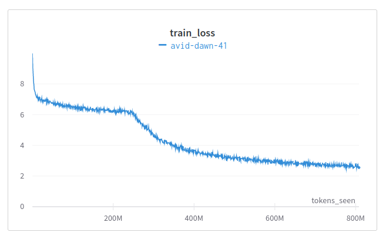

# W2D2 Part 4 - Pretraining

Write a training loop that loads the data you saved in Part 3 and makes use of your implementations of `random_mask` and `cross_entropy_selected`. (You'll need to change the import to point to your code, and change the path to point to your saved data).

We can't exactly follow the hyperparameters from section A.2 of the paper because they are training a much larger model on a much larger dataset using multiple GPUs.

Don't expect too much out of WikiText-2: deep learning is extremely sample inefficient, and we are orders of magnitude away from the amount of compute needed to pretrain something as good as the real BERT.

For comparison, the [Induction Heads paper](https://transformer-circuits.pub/2022/in-context-learning-and-induction-heads/index.html#results-loss) observed induction heads forming around 2 billion tokens seen, which would require 1000 epochs on our 2 million token dataset. To train a model like PaLM, they used 780 billion tokens for one epoch.

Today, if your model can beat the baseline of just predicting the token frequencies, you can consider it a success. Training the model to do better than predicting token frequencies may take longer than you have available. For reference, to see whether your training run is off-track, here is a plot of the loss for a successful training run:

<p align="center">
    
</p>

## Table of Contents

- [DataLoaders](#dataloaders)
- [Learning Rate Schedule](#learning-rate-schedule)
- [Weight Decay](#weight-decay)
- [Training Loop](#training-loop)
- [Model Evaluation](#model-evaluation)
- [Bonus](#bonus)
    - [Modifying Sequence Length During Training](#modifying-sequence-length-during-training)
    - [Improved Versions of BERT](#improved-versions-of-bert)
    - [Next Sentence Prediction](#next-sentence-prediction)
    - [Applying Scaling Laws](#applying-scaling-laws)


```python
import os
import sys
import torch as t
import transformers
from matplotlib import pyplot as plt
from torch import nn
from torch.nn import functional as F
from torch.utils.data import DataLoader
from torch.utils.data.dataset import TensorDataset
from tqdm.auto import tqdm
import wandb
from w2d1_solution import BertConfig, BertLanguageModel, predict
from w2d2_part3_wikitext_solution import cross_entropy_selected, random_mask

MAIN = __name__ == "__main__"
device = t.device("cuda" if t.cuda.is_available() else "cpu")
IS_CI = os.getenv("IS_CI")
if IS_CI:
    sys.exit(0)

```

## DataLoaders

Adjust the path as necessary.


```python
if MAIN:
    tokenizer = transformers.AutoTokenizer.from_pretrained("bert-base-cased")
    hidden_size = 512
    assert hidden_size % 64 == 0
    bert_config_tiny = BertConfig(
        max_position_embeddings=128,
        hidden_size=hidden_size,
        intermediate_size=4 * hidden_size,
        num_layers=8,
        num_heads=hidden_size // 64,
    )
    config_dict = dict(
        filename="./data/w2d2/bert_lm.pt",
        lr=0.0002,
        epochs=40,
        batch_size=128,
        weight_decay=0.01,
        mask_token_id=tokenizer.mask_token_id,
        warmup_step_frac=0.01,
        eps=1e-06,
        max_grad_norm=None,
    )
    (train_data, val_data, test_data) = t.load("./data/w2d2/wikitext_tokens_103.pt")
    print("Training data size: ", train_data.shape)
    train_loader = DataLoader(
        TensorDataset(train_data), shuffle=True, batch_size=config_dict["batch_size"], drop_last=True
    )

```

## Learning Rate Schedule

The authors used learning rate warmup from an unspecified value and an unspecified shape to a maximum of 1e-4 for the first 10,000 steps out of 1 million, and then linearly decayed to an unspecified value.

It's very common that authors will leave details out of the paper in the interests of space, and the only way to figure it out is hope that they published source code. The source code doesn't always match the actual experimental results, but it's the best you can do other than trying to contact the authors.

From the repo, we can see in [optimization.py](https://github.com/google-research/bert/blob/master/optimization.py) that AdamW is used for the optimizer, that the warmup is linear and that the epsilon used for AdamW is 1e-6.

Assume that the initial learning rate and the final learning rate are both 1/10th of the maximum, and that we want to warm-up for 1% of the total number of steps.

<details>

<summary>Expected LR Schedule</summary>

<p align="center">
    
</p>

</details>


```python
def lr_for_step(step: int, max_step: int, max_lr: float, warmup_step_frac: float):
    """Return the learning rate for use at this step of training."""
    pass


if MAIN:
    max_step = int(len(train_loader) * config_dict["epochs"])
    lrs = [
        lr_for_step(step, max_step, max_lr=config_dict["lr"], warmup_step_frac=config_dict["warmup_step_frac"])
        for step in range(max_step)
    ]
    (fig, ax) = plt.subplots(figsize=(12, 4))
    ax.plot(lrs)
    ax.set(xlabel="Step", ylabel="Learning Rate", title="Learning Rate Schedule")

```

## Weight Decay

The BERT paper specifies that a "L2 weight decay" of 0.01 is used, but leaves unspecified exactly which parameters have weight decay applied. Recall that weight decay is an inductive bias, which in the case of linear regression is exactly equivalent to a prior that each weight is Gaussian distributed.

For modern deep learning models, weight decay is much harder to analyze, having interactions with adaptive learning rate methods and normalization layers. Papers on weight decay feature phrases like "The effect of weight decay remains poorly understood" [1](https://arxiv.org/pdf/1810.12281.pdf) or "despite its ubiquity, its behavior is still an area of active research" [2](https://www.cs.cornell.edu/gomes/pdf/2021_bjorck_aaai_wd.pdf), and you'll see different implementations do different things.

Today we're going to use weight decay conservatively, and only apply it to the weight (and not the bias) of each `Linear` layer. I didn't find much effect, but it provides an opportunity to learn how to use [parameter groups](https://pytorch.org/docs/stable/optim.html#per-parameter-options) in the optimizer.


```python
def make_optimizer(model: BertLanguageModel, config_dict: dict) -> t.optim.AdamW:
    """
    Loop over model parameters and form two parameter groups:

    - The first group includes the weights of each Linear layer and uses the weight decay in config_dict
    - The second has all other parameters and uses weight decay of 0
    """
    pass


if MAIN:
    test_config = BertConfig(
        max_position_embeddings=4, hidden_size=1, intermediate_size=4, num_layers=3, num_heads=1, head_size=1
    )
    optimizer_test_model = BertLanguageModel(test_config)
    opt = make_optimizer(optimizer_test_model, dict(weight_decay=0.1, lr=0.0001, eps=1e-06))
    expected_num_with_weight_decay = test_config.num_layers * 6 + 1
    wd_group = opt.param_groups[0]
    actual = len(wd_group["params"])
    assert (
        actual == expected_num_with_weight_decay
    ), f"Expected 6 linear weights per layer (4 attn, 2 MLP) plus the final lm_linear weight to have weight decay, got {actual}"
    all_params = set()
    for group in opt.param_groups:
        all_params.update(group["params"])
    assert all_params == set(optimizer_test_model.parameters()), "Not all parameters were passed to optimizer!"

```

## Training Loop

Write your training loop here, logging to Weights and Biases. Tips:

- Log your training loss and sanity check that it looks reasonable. At initialization it should be around the value of random prediction; if it's much higher, then you probably have a bug in your weight initialization code.
- By 10M tokens, if your model hasn't basically figured out the unigram frequencies then you probably have a bug, or you changed your hyperparameters to bad ones.
- Log your learning rate as well, as it's easy to not apply the learning rate schedule properly.
- If you use gradient clipping, note that `clip_grad_norm_` returns the norm of the gradients. It's useful to know if your clipping is actually doing anything.


```python
def bert_mlm_pretrain(model: BertLanguageModel, config_dict: dict, train_loader: DataLoader) -> None:
    """Train using masked language modelling."""
    pass


if MAIN:
    model = BertLanguageModel(bert_config_tiny)
    num_params = sum((p.nelement() for p in model.parameters()))
    print("Number of model parameters: ", num_params)
    bert_mlm_pretrain(model, config_dict, train_loader)

```

## Model Evaluation

You can test the model's predictions, but they're going to be underwhelming given our limited computational budget.


```python
if MAIN:
    model = BertLanguageModel(bert_config_tiny)
    model.load_state_dict(t.load(config_dict["filename"]))
    your_text = "The Answer to the Ultimate Question of Life, The Universe, and Everything is [MASK]."
    predictions = predict(model, tokenizer, your_text)
    print("Model predicted: \n", "\n".join(map(str, predictions)))

```

## Bonus

Congratulations, you've finished the main content for today!

You can do whatever bonus section(s) seem interesting to you.

### Modifying Sequence Length During Training

The authors pretrained using a sequence length of just 128 for 90% of the steps, then completed training with sequence length of 512. Try this and see what happens.

### Improved Versions of BERT

Read about one of the improved versions of BERT and try to replicate it. Some good ones to try:

- [ELECTRA](https://arxiv.org/pdf/2003.10555.pdf%27)
- [DEBERTA](https://arxiv.org/pdf/2006.03654.pdf)
- [DistilBERT](https://arxiv.org/pdf/1910.01108.pdf)

### Next Sentence Prediction

Try to pretrain on the next sentence prediction task.

### Applying Scaling Laws

The paper [Training Compute-Optimal Large Language Models](https://arxiv.org/pdf/2203.15556.pdf) attempts to find the optimal model and dataset sizes for a given amount of compute. If you were to extrapolate their curves down to our very limited amount of compute, what does the paper suggest would be the ideal model and dataset size?

