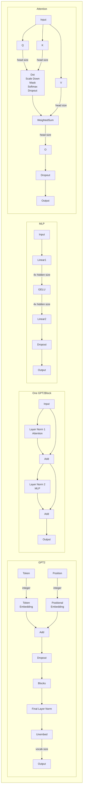

# W2D3 - GPT-2

In Part 1, you'll implement your own GPT-2 architecture and load pretrained weights from the real GPT-2. In Part 2, you'll implement algorithms for sampling text from autoregressive models!

## Table of Contents

- [Readings](#readings)
- [Inspecting the Pretrained Model](#inspecting-the-pretrained-model)
- [Unidirectional Attention](#unidirectional-attention)
- [GPT-2 Block](#gpt--block)
- [Full GPT-2](#full-gpt-)
- [Loading Pretrained Weights](#loading-pretrained-weights)
- [Model Evaluation](#model-evaluation)

## Readings

- [Language Modelling with Transformers](https://docs.google.com/document/d/1XJQT8PJYzvL0CLacctWcT0T5NfL7dwlCiIqRtdTcIqA/edit#)
- [How to generate text: using different decoding methods for language generation with Transformers](https://huggingface.co/blog/how-to-generate) - don't worry about the API of HuggingFace - we are going to implement these algorithms ourselves.


Unless otherwise indicated on the schematic, all arrows represent vectors of size `embedding_size = 768`.

We are only doing inference today, so while you should include the dropout layers, they won't be used and the tests won't check for them.



## Inspecting the Pretrained Model

Load the pretrained GPT-2 using the provided `load_pretrained_gpt` function. Note that this is the small version of GPT-2, which at 4 bytes per parameter is roughly 500MB. The largest GPT-2 version is around 6GB. Inspect the shapes of parameters in an attention layer. Make a list of things that look different than you expected before proceeding.

<details>
<summary>Spoiler - Show Differences</summary>

- `c_attn` and `c_proj` use a `Conv1D` instead of `Linear`. These are equivalent in this case and you can load the weights into your `Linear` directly.
- `c_attn.weight` has shape `[768, 2304]` - this is the `Q`, `K`, and `V` matrixes concatenated in that order. The point of concatenating them is to apply them all to the input in one call. You can `torch.split()` the result.
- `c_proj.weight` has shape `[768, 768]` - this is the `O` matrices for each head concatenated.

</details>


```python
import math
import os
from dataclasses import dataclass
from typing import Any, Optional
import torch as t
import transformers
from einops import rearrange
from fancy_einsum import einsum
from torch import nn
import utils
import w2d3_test

os.environ["TOKENIZERS_PARALLELISM"] = "false"
MAIN = __name__ == "__main__"


@dataclass(frozen=True)
class GPTConfig:
    """Constants used throughout the GPT2 model."""

    activation_function: str = "gelu"
    num_layers: int = 12
    num_heads: int = 12
    vocab_size: int = 50257
    hidden_size: int = 768
    max_position_embeddings: int = 1024
    dropout: float = 0.1
    layer_norm_epsilon: float = 1e-05


config = GPTConfig()
if MAIN:
    pretrained_gpt = utils.load_pretrained_gpt()

```

## Unidirectional Attention

Implement unidirectional attention with multiple heads and batching, keeping in mind:

- Use the names `qkv_proj` and `output_proj` as indicated in the class definition.
- Wherever q cannot attend to k (because q is earlier in the sequence than k), set the corresponding attention score (pre-softmax) to -1e4
- Don't forget to divide your attention scores by $\sqrt{head size}$
- Make sure any created tensors are on the correct device.
- `head_size` should default to `hidden_size // num_heads` if not specified.
- Ignore the cache parameter for now - we'll use it in a later section.
- attn_dropout is applied to the attention probabilities, before multiplying with v.
- resid_dropout is applied to the final output.


```python
class UnidirectionalAttention(nn.Module):
    qkv_proj: nn.Linear
    output_proj: nn.Linear
    attn_dropout: nn.Dropout
    resid_dropout: nn.Dropout

    def __init__(self, hidden_size: int, num_heads: int, head_size: Optional[int] = None, dropout=0.1):
        super().__init__()
        self.hidden_size = hidden_size
        assert hidden_size % num_heads == 0
        pass

    def forward(self, x: t.Tensor, cache: Optional[Any] = None) -> t.Tensor:
        """
        x: shape (batch, seq, hidden_size)

        Return: shape (batch, seq, hidden_size)
        """
        pass


if MAIN:
    w2d3_test.test_unidirectional_attn(UnidirectionalAttention)

```

## GPT-2 Block

Build the GPTBlock class according to the diagram.

- Initialize your sub-modules in the order they're used.


```python
ACTIVATION_FUNCTIONS = dict(relu=nn.ReLU(), gelu=nn.GELU())


class GPT2Block(nn.Module):
    attn: UnidirectionalAttention
    linear1: nn.Linear
    linear2: nn.Linear
    ln1: nn.LayerNorm
    ln2: nn.LayerNorm

    def __init__(
        self, hidden_size: int, num_heads: int, dropout: float, layer_norm_epsilon: float, activation_function: str
    ):
        super().__init__()
        pass

    def forward(self, x: t.Tensor, cache: Optional[Any] = None) -> t.Tensor:
        """
        x: shape (batch, seq, hidden_size)

        Return: shape (batch, seq, hidden_size)
        """
        pass


if MAIN:
    w2d3_test.test_gpt_block(GPT2Block)

```

## Full GPT-2

Now build the GPT2 class according to the diagram.

- The unembedding shouldn't be its own `nn.Embedding`. Instead, in `forward`, write an `einsum` using `token_embedding.weight` to perform the unembedding.
- Again, initialize your sub-modules in the order they're used, and token embedding before position embedding.
- Again, make sure any created tensors are on the correct device.


```python
class GPT2(nn.Module):
    token_embedding: nn.Embedding
    pos_embedding: nn.Embedding
    ln: nn.LayerNorm
    blocks: utils.StaticModuleList[GPT2Block]

    def __init__(self, config: GPTConfig):
        super().__init__()
        pass

    def forward(self, x: t.Tensor, cache: Optional[Any] = None) -> t.Tensor:
        """
        x: shape (batch, seq), dtype t.int64 - the token ids

        Return: shape (batch, seq, vocab_size), dtype t.float32- the output logits
        """
        pass


if MAIN:
    w2d3_test.test_gpt(GPT2)

```

## Loading Pretrained Weights

Tweak the provided code to load the weights into your model. You should only need to adjust the variable names to match the ones in your model.


```python
def _copy_weight_bias(mine, theirs, transpose=False):
    mine.weight.copy_(theirs.weight.T if transpose else theirs.weight)
    if mine.bias is not None:
        mine.bias.copy_(theirs.bias)


def load_pretrained_weights():
    pretrained_gpt = utils.load_pretrained_gpt()
    my_gpt = GPT2(config)
    for p in my_gpt.parameters():
        p.requires_grad = False
    my_gpt.token_embedding.weight.copy_(pretrained_gpt.transformer.wte.weight)
    my_gpt.pos_embedding.weight.copy_(pretrained_gpt.transformer.wpe.weight)
    _copy_weight_bias(my_gpt.ln, pretrained_gpt.transformer.ln_f)
    from transformers.models.gpt2.modeling_gpt2 import GPT2Block as HFGPT2Block

    my_block: GPT2Block
    hf_block: HFGPT2Block
    for (my_block, hf_block) in zip(my_gpt.blocks, pretrained_gpt.transformer.h):
        _copy_weight_bias(my_block.ln1, hf_block.ln_1)
        _copy_weight_bias(my_block.attn.qkv_proj, hf_block.attn.c_attn, transpose=True)
        _copy_weight_bias(my_block.attn.output_proj, hf_block.attn.c_proj, transpose=True)
        _copy_weight_bias(my_block.ln2, hf_block.ln_2)
        _copy_weight_bias(my_block.linear1, hf_block.mlp.c_fc, transpose=True)
        _copy_weight_bias(my_block.linear2, hf_block.mlp.c_proj, transpose=True)
    for p in my_gpt.parameters():
        p.requires_grad_(True)
    return my_gpt

```

## Model Evaluation

If everything worked correctly, your GPT-2 should have an idea about which presidents's names start with George:


```python
if MAIN:
    my_gpt = load_pretrained_weights()
    my_gpt.eval()
    tokenizer = transformers.AutoTokenizer.from_pretrained("gpt2")
    w2d3_test.test_load_pretrained_weights(my_gpt, tokenizer)

```

On to part 2!
